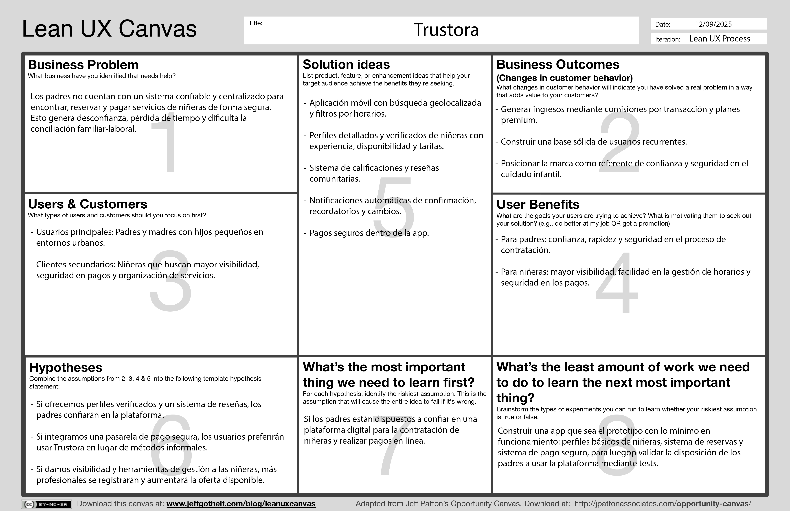
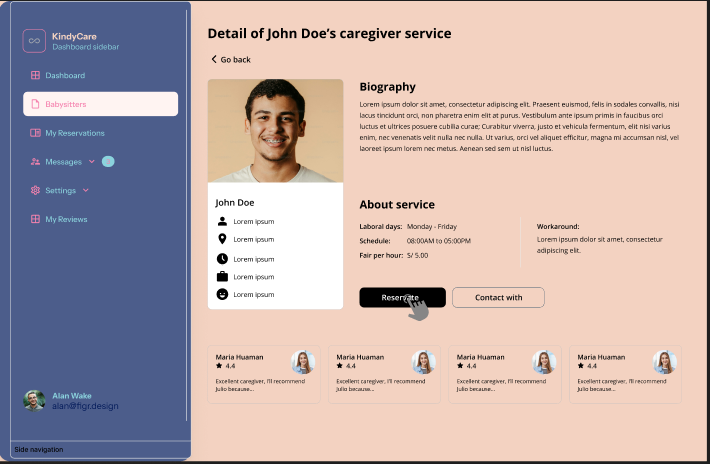

<h1 align="center">Universidad Peruana de Ciencias Aplicadas</h1>
<div align="center">
    </img>
</div>
<h2 align="center">Ingeniería de Software</h2>
<h3 align="center">Diseño de Experimentos de Ingeniería de Software - 1ASI0732</h3>
<h3 align="center">Profesor: Tinoco Licas, Juan Carlos</h3>
<h3 align="center">INFORME DE TRABAJO FINAL</h3>
<h3 align="center">Startup: Trustora</h3>
<h3 align="center">Producto:KidyCare</h3>

<div>
     <table align="center">
        <tr>
            <th style="text-align:center;">Member</th>
            <th style="text-align:center;">Code</th>
        </tr>
        <tr>
            <td>Meza Camayo, Lynn Jeeferzon</td>
            <td>U20201C320</td>
        </tr>
        <tr>
            <td>Alvarez Ponce, Carlos Antonio</td>
            <td>U201919386</td>
        </tr>
        <tr>
           <td>Orellana Rodriguez, Mel Andree</td>
           <td>u202116018</td>
        </tr>
        <tr>
           <td>Mazuelos Callirgos, Marcelo Alessandro </td>
           <td>u201916143</td>
        </tr>
    </table>
</div>

<h3 align="center">Agosto 2025</h3>

---

## REGISTRO DE VERSIONES

| Versión | Fecha    | Autor                                            | Descripción de Modificación            |
| ------- | -------- | ------------------------------------------------ | -------------------------------------- |
| 0.1     | 06/09/25 | Lynn Meza                                        | Desarrollo de la Structura del informe |
| 0.2     | 21/09/25 | - Lynn Meza - Marcelo Mazuelos - Andree Orellana | Desarrollo de la TB1                   |

## PROJECT REPORT COLLABORATION INSIGHTS

URL del repositorio del project Report : <https://github.com/orgs/Grupo4-1ASI0732-14736-Trustora/repositories>

_TB1_

Para el desarrollo de la entrega TB1, se opto por dividir el trabajo de la siguiente forma:

| Integrante                             | Actvidades Asignadas                           |
| -------------------------------------- | ---------------------------------------------- |
| Mazuelos Callirgos, Marcelo Alessandro | - capitulo 1 - 4- Entrevista 2 segementos- ppt |
| Orellana Rodriguez, Mel Andree         | - Capitulo 2-4-5.1-entrevista - ppt            |
| Meza Camayo, Lynn Jeeferzon            | - capitulo 3-4-5.2- ppt                        |


## CONTENIDO

### Tabla de contenido

- [Capítulo I: Introducción](#capítulo-i-introducción)
  - [1.1. Startup Profile](#11-startup-profile)
    - [1.1.1. Descripción de la Startup](#111-descripción-de-la-startup)
    - [1.1.2. Perfiles de integrantes del equipo](#112-perfiles-de-integrantes-del-equipo)
  - [1.2. Solution Profile](#12-solution-profile)
    - [1.2.1 Antecedentes y problemática](#121-antecedentes-y-problemática)
    - [What (¿Qué?)](#what-qué)
    - [When (¿Cuándo?)](#when-cuándo)
    - [Where (¿Donde?)](#where-donde)
    - [Who (¿Quienes?)](#who-quienes)
    - [Why (¿Por qué?)](#why-por-qué)
    - [How (¿Cómo?)](#how-cómo)
    - [How much (¿Cuánto?)](#how-much-cuánto)
    - [1.2.2 Lean UX Process.](#122-lean-ux-process)
      - [1.2.2.1. Lean UX Problem Statements.](#1221-lean-ux-problem-statements)
      - [1.2.2.2. Lean UX Assumptions.](#1222-lean-ux-assumptions)
      - [1.2.2.3. Lean UX Hypothesis Statements.](#1223-lean-ux-hypothesis-statements)
      - [1.2.2.4. Lean UX Canvas.](#1224-lean-ux-canvas)
  - [1.3. Segmentos objetivo.](#13-segmentos-objetivo) - [**a)Padres/Tutores:**](#apadrestutores) - [Segmentación Geográfica:](#segmentación-geográfica) - [Segmentación Demográfica:](#segmentación-demográfica) - [Segmentación Psicográfica:](#segmentación-psicográfica) - [Segmentación Conductual:](#segmentación-conductual) - [**b) Niñeras/Cuidadores:**](#b-niñerascuidadores) - [Segmentación Geográfica:](#segmentación-geográfica-1) - [Segmentación Demográfica:](#segmentación-demográfica-1) - [Segmentación Psicográfica:](#segmentación-psicográfica-1) - [Segmentación Conductual:](#segmentación-conductual-1)
- [Capítulo II: Requirements Elicitation \& Analysis](#capítulo-ii-requirements-elicitation--analysis)
  - [2.1. Competidores.](#21-competidores)
    - [2.1.1. Análisis competitivo.](#211-análisis-competitivo)
- [Panorama de análisis competitivo](#panorama-de-análisis-competitivo)
  - [Análisis FODA](#análisis-foda)
    - [2.1.2. Estrategias y tácticas frente a competidores.](#212-estrategias-y-tácticas-frente-a-competidores)
  - [2.2. Entrevistas.](#22-entrevistas)
    - [2.2.1. Diseño de entrevistas.](#221-diseño-de-entrevistas)
    - [Preguntas para niñeras certificadas:](#preguntas-para-niñeras-certificadas)
    - [Preguntas para Para padres de familia](#preguntas-para-para-padres-de-familia)
    - [2.2.2. Registro de entrevistas.](#222-registro-de-entrevistas)
      - [Entrevista:](#entrevista)
      - [Entrevista:](#entrevista-1)
      - [Segmento 2:Padres de familia](#segmento-2padres-de-familia)
      - [Entrevista:](#entrevista-2)
      - [Entrevista:](#entrevista-3)
    - [2.2.3. Análisis de entrevistas.](#223-análisis-de-entrevistas)
  - [2.3. Needfinding.](#23-needfinding)
    - [2.3.1. User Personas.](#231-user-personas)
    - [2.3.2. User Task Matrix.](#232-user-task-matrix)
    - [2.3.3. User Journey Mapping.](#233-user-journey-mapping)
    - [2.3.4. Empathy Mapping.](#234-empathy-mapping)
    - [2.3.5. As-is Scenario Mapping.](#235-as-is-scenario-mapping)
  - [2.4. Ubiquitous Language.](#24-ubiquitous-language)
- [Capítulo III: Requirements Specification](#capítulo-iii-requirements-specification)
  - [3.1. To-Be Scenario Mapping.](#31-to-be-scenario-mapping)
  - [3.2. User Stories.](#32-user-stories)
  - [3.3. Impact Mapping.](#33-impact-mapping)
  - [3.4. Product Backlog.](#34-product-backlog)
- [Capítulo IV: Product Design](#capítulo-iv-product-design)

  - [4.1. Style Guidelines](#41-style-guidelines)

    - [4.1.1. General Style Guidelines](#411-general-style-guidelines)
    - [4.1.2. Web Style Guidelines](#412-web-style-guidelines)
    - [4.1.3. Mobile Style Guidelines](#413-mobile-style-guidelines)
      - [4.1.3.1. iOS Mobile Style Guidelines](#4131-ios-mobile-style-guidelines)
      - [4.1.3.2. Android Mobile Style Guidelines](#4132-android-mobile-style-guidelines)

  - [4.2. Information Architecture](#42-information-architecture)

    - [4.2.1. Organization Systems](#421-organization-systems)
    - [4.2.2. Labeling Systems](#422-labeling-systems)
    - [4.2.3. SEO Tags and Meta Tags](#423-seo-tags-and-meta-tags)
    - [4.2.4. Searching Systems](#424-searching-systems)
    - [4.2.5. Navigation Systems](#425-navigation-systems)

  - [4.3. Landing Page UI Design](#43-landing-page-ui-design)

    - [4.3.1. Landing Page Wireframe](#431-landing-page-wireframe)
    - [4.3.2. Landing Page Mock-up](#432-landing-page-mock-up)

  - [4.4. Mobile Applications UX/UI Design](#44-mobile-applications-uxui-design)

    - [4.4.1. Mobile Applications Wireframes](#441-mobile-applications-wireframes)
    - [4.4.2. Mobile Applications Wireflow Diagrams](#442-mobile-applications-wireflow-diagrams)
    - [4.4.3. Mobile Applications Mock-ups](#443-mobile-applications-mock-ups)
    - [4.4.4. Mobile Applications User Flow Diagrams](#444-mobile-applications-user-flow-diagrams)

  - [4.5. Mobile Applications Prototyping](#45-mobile-applications-prototyping)

    - [4.5.1. Android Mobile Applications Prototyping](#451-android-mobile-applications-prototyping)
    - [4.5.2. iOS Mobile Applications Prototyping](#452-ios-mobile-applications-prototyping)

  - [4.6. Web Applications UX/UI Design](#46-web-applications-uxui-design)

    - [4.6.1. Web Applications Wireframes](#461-web-applications-wireframes)
    - [4.6.2. Web Applications Wireflow Diagrams](#462-web-applications-wireflow-diagrams)
    - [4.6.3. Web Applications Mock-ups](#463-web-applications-mock-ups)
    - [4.6.4. Web Applications User Flow Diagrams](#464-web-applications-user-flow-diagrams)

  - [4.7. Web Applications Prototyping](#47-web-applications-prototyping)

  - [4.8. Domain-Driven Software Architecture](#48-domain-driven-software-architecture)

    - [4.8.1. Software Architecture Context Diagram](#481-software-architecture-context-diagram)
    - [4.8.2. Software Architecture Container Diagrams](#482-software-architecture-container-diagrams)
    - [4.8.3. Software Architecture Components Diagrams](#483-software-architecture-components-diagrams)

  - [4.9. Software Object-Oriented Design](#49-software-object-oriented-design)

    - [4.9.1. Class Diagrams](#491-class-diagrams)
    - [4.9.2. Class Dictionary](#492-class-dictionary)

  - [4.10. Database Design](#410-database-design)
    - [4.10.1. Database Diagram](#4101-database-diagram)

- [Capítulo V: Product Implementation, Validation \& Deployment](#capítulo-v-product-implementation-validation--deployment)

  - [5.1. Software Configuration Management](#51-software-configuration-management)

    - [5.1.1. Software Development Environment Configuration](#511-software-development-environment-configuration)
    - [5.1.2. Source Code Management](#512-source-code-management)
    - [5.1.3. Source Code Style Guide & Conventions](#513-source-code-style-guide--conventions)
    - [5.1.4. Software Deployment Configuration](#514-software-deployment-configuration)

  - [5.2. Landing Page, Services & Applications Implementation](#52-landing-page-services--applications-implementation)

    - [5.2.1. Sprint Backlogs](#521-sprint-backlogs)
    - [5.2.2. Implemented Landing Page Evidence](#522-implemented-landing-page-evidence)
    - [5.2.3. Implemented Frontend-Web Application Evidence](#523-implemented-frontend-web-application-evidence)
    - [5.2.4. Implemented Native-Mobile Application Evidence](#524-implemented-native-mobile-application-evidence)
    - [5.2.5. Implemented RESTful API and/or Serverless Backend Evidence](#525-implemented-restful-api-andor-serverless-backend-evidence)
    - [5.2.6. RESTful API documentation](#526-restful-api-documentation)
    - [5.2.7. Team Collaboration Insights](#527-team-collaboration-insights)

  - [5.3. Video About-the-Product](#53-video-about-the-product)

  ***

  - [Conclusiones y recomendaciones](#conclusiones-y-recomendaciones)
  - [Video About-the-Team](#video-about-the-team)
  - [Bibliografía Anexos](#bibliografía-anexos)

## STUDENT OUTCOME

<table>
    <tr>
        <th>CRITERIO ESPECIFICO</th>
        <th>ACCIONES REALIZADAS</th>
        <th>CONCLUSIONES</th>
    </tr>
    <tr>
        <td>4.c.1 Reconoce responsabilidad ética y profesional en situaciones de ingeniería de software</td>
        <td>
             *Mel Andree Orellana: TB1*
            - Diseñé entrevistas dirigidas a niñeras certificadas y padres de familia, respetando principios éticos como la confidencialidad y el consentimiento informado.<br>
            - Registré entrevistas evitando sesgos y garantizando la veracidad de la información.<br>
            - En el Needfinding desarrollé herramientas (User Personas, User Task Matrix, Journey Mapping, Empathy Mapping, As-is Scenario Mapping) priorizando la voz real de los usuarios.<br>
             *Marcelo Mazuelos: TB1*
            - Realicé la descripcipin del startup, junto con la misión y visión de la empresa. Identificando nuestro objetivos en mente para la propuesta.<br>
            - Se hizo el proceso de identificación en Antecedentes y problemática, haciendo uso de la técnica 5w2h para nuestros primeros identificadores iniciales.<br>
            - Se investigó acerca de los Segmentos objetivo para obtener un sustento estadístico y ver el requerimiento de nuestra app en el sector demográfico.<br>
            **Lynn Meza: TB1** <br>
            elaborar las historias de usuario, el product backlog, el Sprint 1 y los wireframes, reconozco mi responsabilidad ética y profesional como estudiante de ingeniería de software. Me aseguré de que cada decisión tomada buscara garantizar la calidad, seguridad y usabilidad de la aplicación, priorizando siempre las necesidades reales de los usuarios. Además, tuve en cuenta la importancia de proteger la información sensible y de generar confianza en la plataforma, entendiendo que el trabajo realizado impacta directamente en las personas que utilizarán el sistema.
        </td>
        <td>
            - Se cumplió con un proceso investigativo ético y profesional, valorando la opinión de los usuarios como base para un diseño responsable.<br>
            - Mi aporte asegura que las futuras soluciones de software estén fundamentadas en necesidades reales y no en supuestos, reforzando la credibilidad del proyecto.
        </td>
    </tr>
    <tr>
        <td>4.c.2 Emite juicios informados considerando el impacto de las soluciones de ingeniería de software en contextos globales, económicos, ambientales y sociales</td>
        <td>
              *Mel Andree Orellana: TB1*
            - A partir de las entrevistas y el análisis de necesidades, identifiqué que el software debe adaptarse a distintos contextos familiares y laborales (ej. disponibilidad de tiempo, acceso digital).<br>
            - En el User Journey Mapping y el Empathy Mapping se evidenciaron problemáticas sociales como la confianza en el cuidado infantil y la seguridad de datos.<br>
            - En el Ubiquitous Language, propuse términos claros y comunes que fomentan la inclusión y entendimiento entre equipo técnico y usuarios.<br>
             *Marcelo Mazuelos: TB1*
            - En el User Journey Mapping y el Empathy Mapping se evidenciaron problemáticas sociales como la confianza en el cuidado infantil y la seguridad de datos.<br>
            - Con el Lean UX Process (Lean UX Problem Statement, Assumptins, Hypothesis Statement y Canvas) se hizo introspectiva en la problemática identificando los segmentos objetivos, sus necesidades y en que enfocarnos.<br>
            - Se realizó la elaboración del Information Architecture, cumpliendo con el Organization Systems, Labeling Systems, SEO Tags and Meta Tags, Searching Systems y Navigation Systems.<br>
             **Lynn Meza: TB1** <br>
             Al desarrollar las historias de usuario, el product backlog, el Sprint 1 y los wireframes, emití juicios informados considerando no solo la parte técnica, sino también el impacto que la solución puede tener en distintos contextos globales, económicos, ambientales y sociales. Reconozco que una aplicación como KidyCare no solo responde a una necesidad puntual de los padres, sino que también puede generar oportunidades de empleo formal para niñeras, optimizar recursos mediante procesos digitales más eficientes y aportar a un entorno social más seguro y confiable. De esta manera, busqué que cada decisión de diseño y planificación estuviera alineada con una visión de responsabilidad integral en la ingeniería de software.
        </td>
        <td>
            - Mis aportes ayudan a emitir juicios que reconocen el impacto social (seguridad de menores, confianza de padres), económico (accesibilidad del servicio), y global (posibilidad de replicar el modelo en otros contextos).<br>
            - De esta forma, la solución propuesta busca equilibrar innovación tecnológica con responsabilidad social.
        </td>
    </tr>
</table>

# Capítulo I: Introducción

## 1.1. Startup Profile

### 1.1.1. Descripción de la Startup

**KidyCare** es una aplicación móvil que conecta a padres con niñeras de forma rápida, segura y confiable. Permite buscar disponibilidad por ubicación y horarios, reservar servicios, pagar en línea y acceder a perfiles verificados con reseñas de otros usuarios.

**Misión:**
Brindar a los padres una solución práctica y segura para encontrar cuidado infantil confiable, al mismo tiempo que ofrecemos a las niñeras una plataforma que potencie su visibilidad y facilite la gestión de sus servicios.

**Visión:**
Convertirse en la plataforma líder en cuidado infantil en Latinoamérica, reconocida por la confianza, seguridad y eficiencia en la conexión entre familias y profesionales del cuidado.

### 1.1.2. Perfiles de integrantes del equipo

| Integrantes                                                                                                                                                                              | Descripción                                                                                                                                                                                                                                                                                                       | Conocimientos                                                                                                                                     |
| :--------------------------------------------------------------------------------------------------------------------------------------------------------------------------------------- | :---------------------------------------------------------------------------------------------------------------------------------------------------------------------------------------------------------------------------------------------------------------------------------------------------------------- | :------------------------------------------------------------------------------------------------------------------------------------------------ |
|  <br>**Mazuelos Callirgos, Marcelo Alessandro**                                                                  | Estudiante de Ingeniería de Software.                                                                                                                                                                                                                                                                             |                                                                                                                                                   |
|  <br>**Carlos Alvarez Ponce** | Estudiante de Ingeniería de Software. Me considero una persona comprometida, organizada y con una gran capacidad para adaptarme a nuevos retos. Me apasiona crear soluciones tecnológicas innovadoras, y en cada proyecto busco aportar lo mejor de mí para resolver los problemas de forma efectiva y eficiente. | Tengo experiencia en desarrollo de software y programación en lenguajes como JavaScript, C++, Python y tecnologías modernas como Next.js y React. |
|  <br>**Orellana Rodriguez, Mel Andree**                                                                     | Estudiante de Ingeniería de Software, comprometido con el trabajo en equipo, proactivo y orientado a resultados, con interés en aportar soluciones tecnológicas innovadoras.                                                                                                                                      | HTML, CSS, JavaScript, SQL (frontend y bases de datos), Python (programación, automatización y análisis).                                         |
|  <br>**Meza Camayo, Lynn Jeeferzon**                                                                                             | Estudiante de Ingenería de Software. Me considero proactivo, responsable y abierto a nuevos aprendizajes, aportando compromiso, trabajo en equipo y apoyo constante a mis compañeros para alcanzar cada meta propuesta.                                                                                           | HTML, CSS, JavaScript, SQL, Python, PHP y JAVA                                                                                                    |

## 1.2. Solution Profile

### 1.2.1. Antecedentes y problemática

#### What (¿Qué?)

Dificultad para encontrar niñeras de confianza de forma rápida y segura, así como la falta de un sistema centralizado para reservas, pagos y gestión de servicios de cuidado infantil.

#### When (¿Cuándo?)

Cuando los padres necesitan apoyo en el cuidado de sus hijos debido a compromisos laborales, emergencias, actividades sociales o necesidades puntuales de tiempo libre.

#### Where (¿Dónde?)

Principalmente en entornos urbanos donde la demanda de servicios de cuidado infantil es mayor y las familias cuentan con menos apoyo de redes cercanas (familiares o amigos).

#### Who (¿Quiénes?)

- Padres y madres con hijos pequeños que requieren cuidado confiable.

- Niñeras con experiencia que buscan visibilidad, seguridad y gestión eficiente de su trabajo.

#### Why (¿Por qué?)

Porque los métodos tradicionales (recomendaciones boca a boca o grupos informales) no garantizan confianza, disponibilidad ni seguridad, y generan incertidumbre al contratar un servicio tan delicado como el cuidado de los niños.

#### How (¿Cómo?)

A través de una aplicación móvil que:

- Centraliza búsqueda, reserva y pago.

- Ofrece perfiles verificados y valoraciones.

- Usa notificaciones para confirmar citas y cambios.

- Proporciona pasarela de pago segura.

#### How much (¿Cuánto?)

El valor está en la confianza y practicidad. Los ingresos provendrán de:

- Comisión por cada transacción.

- Suscripciones premium para niñeras o padres con beneficios adicionales.

### 1.2.2. Lean UX Process

#### 1.2.2.1. Lean UX Problem Statements

##### **Domain**<br>

Servicios de cuidado infantil bajo demanda a través de plataformas digitales móviles.

##### **Customer Segments**<br>

1. **Padres y madres** en áreas urbanas con hijos pequeños que necesitan apoyo en el cuidado.
2. **Niñeras y cuidadoras** que buscan visibilidad, seguridad y oportunidades de trabajo organizadas.

##### **Pain Points**<br>

- Dificultad para encontrar niñeras confiables de manera rápida.
- Falta de información verificable sobre experiencia y disponibilidad.
- Métodos de contratación informales que no garantizan seguridad.
- Pagos poco seguros o poco prácticos fuera de plataformas digitales.
- Falta de organización y comunicación clara en la gestión de reservas.

##### **Gap**<br>

No existe en el mercado local una solución integral que combine búsqueda, verificación, reserva, pago seguro y confianza comunitaria en un solo ecosistema digital sobre el problema planteado.

##### **Vision / Strategy**<br>

- Visión: Convertirse en la plataforma líder en confianza y eficiencia para la contratación de niñeras en Latinoamérica.

- Estrategia: Ofrecer una app intuitiva y confiable que centralice todos los procesos (búsqueda, reserva, pago y reseñas) mientras garantiza seguridad y transparencia para ambas partes.

##### **Initial Segment**<br>

Padres jóvenes, entre 25 y 40 años, que viven en zonas urbanas de nivel socioeconómico medio y medio-alto, con acceso a smartphones y disposición a pagar por soluciones digitales seguras.

#### 1.2.2.2. Lean UX Assumptions

- Los padres están dispuestos a usar tecnología móvil para gestionar servicios de cuidado infantil.

- La seguridad y las reseñas son factores decisivos en la elección de niñeras.

- Las niñeras buscan una plataforma que les dé mayor visibilidad y oportunidades de trabajo.

#### 1.2.2.3. Lean UX Hypothesis Statements

- Creemos que si ofrecemos perfiles verificados y un sistema de reseñas, los padres confiarán más en la plataforma.

- Creemos que si incluimos pagos seguros en la app, los padres preferirán usar Trustora en lugar de métodos informales.

- Creemos que si damos a las niñeras visibilidad y herramientas de gestión, más profesionales se registrarán y aumentará la oferta en la plataforma.

#### 1.2.2.4. Lean UX Canvas

<div align="left">
   
</div>

## 1.3. Segmentos objetivo

### a) Padres/Tutores:

#### Características demográficas:

- **Edad**: 25 ‒ 40 años.
- **Nivel socioeconómico**: medio a medio-alto.
- **Ubicación**: ciudades grandes (por ejemplo, Lima u otras capitales latinoamericanas).
- **Estado laboral**: empleados con horarios fijos o mixtos, profesionales que necesitan apoyo externo de cuidado infantil.

#### Necesidades:

- Soluciones confiables para el cuidado de sus hijos cuando trabajan (horarios de oficina, actividad profesional, imprevistos).
- Transparencia en la experiencia y calificaciones de la niñera.
- Reservas y pagos fáciles y seguros.
- Confianza en la seguridad del servicio (antecedentes, reseñas, verificación).
- Flexibilidad según horarios y cambios inesperados.

#### Motivaciones:

- Aliviar la carga de coordinar cuidado infantil sin depender solo de familiares.
- Deseo de equilibrar vida laboral y familiar.
- Seguridad de que el hijo esté en buenas manos.
- Comodidad y ahorro de tiempo al gestionar todo desde una app.

#### Sustento estadístico:

Según la Encuesta Nacional de Uso del Tiempo (ENUT) 2024 del INEI (Perú), las mujeres dedican en promedio 4 horas 48 minutos al trabajo no remunerado diario, que incluye cuidado de miembros del hogar y labores domésticas, mientras que los hombres dedican 1 hora 35 minutos.

- Esto indica que una gran parte del cuidado infantil, incluso si es no remunerado, recae en hogares donde alguien (normalmente la madre) ya está muy ocupado, lo que crea demanda para servicios externos de cuidado.

Además, el 77% de peruanos tienen smartphone; de quienes lo tienen, usan aplicaciones móviles para tareas cotidianas (como compras, servicios, pedir comida, etc.).

- Esto sugiere que hay una adopción tecnológica suficientemente alta para una app de reserva/servicio en este tipo de segmentos.

### b) Niñeras/Cuidadores:

#### Características demográficas:

- **Edad**: aproximadamente 18 ‒ 45 años.
- Mujeres en su mayoría.
- **Ubicación**: zonas urbanas, barrios donde haya mayor densidad de población de familias que demandan cuidado infantil.
- Con experiencia previa en cuidado de niños, ya sea formal o informal, pero pocos recursos para publicidad o clientes fijos.

#### Necesidades:

- Plataforma que les permita mostrar su experiencia, tarifas, disponibilidad.
- Mecanismos confiables de pago y seguridad (no depender de pagos en efectivo o de confianza informal).
- Flexibilidad de horarios, capacidad de aceptar reservas según su disponibilidad.
- Soporte para obtener reseñas/fidelidad, para generar reputación.
- Seguridad en términos de verificación, buenas condiciones de trabajo y pago justo.

#### Motivaciones:

- Generar ingresos, especialmente si tienen otras responsabilidades domésticas o familiares.
- Flexibilidad para compatibilizar cuidado de sus propios hijos u otros trabajos.
- Obtener clientes confiables sin tener que depender solo del boca a boca.
- Estabilidad económica y reconocimiento profesional.

#### Sustento estadístico:

- En el Perú, un estudio de Touch Task reporta que más del 30% de personas independientes generan ingresos a través de apps por falta de empleo.
- En ese mismo estudio, se señala que el 63% de los usuarios que usan apps para tareas flexibles son jóvenes de 19 a 30 años.
- También, según datos de ese estudio, las mujeres valoran más poder manejar su horario, con 39% que escogen trabajar vía apps por la flexibilidad de no tener horario fijo; en comparación con los hombres.

# Capítulo II: Requirements Elicitation & Analysis

## 2.1. Competidores

| **Nombre**           | **Descripción**                                                                                                                                                                              | **Características Principales**                                                                                                                                          |
| -------------------- | -------------------------------------------------------------------------------------------------------------------------------------------------------------------------------------------- | ------------------------------------------------------------------------------------------------------------------------------------------------------------------------ |
| **Care.com**         | Marketplace global fundado en EE. UU., líder en servicios de cuidado infantil, doméstico y de adultos mayores. Opera en más de 20 países y cuenta con millones de usuarios activos.          | - Amplia red internacional de familias y cuidadores.<br>- Marca globalmente reconocida.<br>- Plataforma con múltiples servicios (niñeras, limpieza, cuidado de adultos). |
| **Babysits**         | Comunidad digital enfocada en conectar familias con niñeras a nivel global. Permite a los usuarios crear perfiles, dejar reseñas y contactar directamente sin intermediarios.                | - Simplicidad en el registro y uso.<br>- Bajos costos para padres y niñeras.<br>- Modelo de comunidad con reseñas públicas.                                              |
| **Agencias Locales** | Empresas presenciales tradicionales que operan en distintas ciudades de Latinoamérica. Se especializan en conectar familias con niñeras mediante entrevistas, contratos y procesos manuales. | - Percepción de formalidad inicial y respaldo legal básico.<br>- Selección presencial de niñeras.<br>- Procesos más lentos y costos de intermediación más altos.         |

### 2.1.1. Análisis competitivo

Para identificar las ventajas competitivas de **Trustora** frente a competidores globales, digitales y tradicionales, reconociendo fortalezas, debilidades, oportunidades y amenazas que permitan afinar la propuesta de valor y asegurar el posicionamiento en el mercado latinoamericano de cuidado infantil.

---

### Comparación por Categorías

| **Categoría**                           | **Trustora (Startup)**                                                                                                  | **Care.com**                                                       | **Babysits**                                                 | **Agencias Locales**                                                            |
| --------------------------------------- | ----------------------------------------------------------------------------------------------------------------------- | ------------------------------------------------------------------ | ------------------------------------------------------------ | ------------------------------------------------------------------------------- |
| **Perfil – Overview**                   | Plataforma digital segura y confiable para conectar padres con niñeras verificadas en Latinoamérica.                    | Marketplace global líder en cuidado infantil y doméstico.          | Comunidad digital con perfiles básicos y sistema de reseñas. | Empresas presenciales que conectan familias con niñeras bajo contrato.          |
| **Ventaja Competitiva**                 | Seguridad (verificación de identidad y antecedentes), personalización avanzada y experiencia fluida en un solo espacio. | Amplia red de usuarios, marca reconocida mundialmente.             | Simplicidad y bajos costos para padres y niñeras.            | Percepción de formalidad inicial y respaldo legal básico.                       |
| **Mercado Objetivo**                    | Padres de clase media y alta en Latinoamérica que buscan confianza y rapidez.                                           | Familias de países desarrollados, principalmente EE. UU. y Europa. | Familias jóvenes que buscan soluciones económicas y rápidas. | Familias tradicionales que prefieren procesos presenciales y contratos físicos. |
| **Estrategias de Marketing**            | Marketing digital (redes sociales, SEO, campañas educativas sobre seguridad).                                           | Publicidad masiva, PR, alianzas con marcas internacionales.        | Posicionamiento web y marketing en buscadores.               | Publicidad local, referidos y boca a boca.                                      |
| **Productos & Servicios**               | Perfiles verificados, reservas online, chat seguro, pagos integrados, seguimiento de servicios.                         | Membresías premium, reservas online, reseñas.                      | Perfiles con reseñas, búsqueda y contacto directo.           | Selección de niñeras, contratos y pagos presenciales.                           |
| **Precios & Costos**                    | Modelo freemium: servicios básicos gratuitos + suscripción premium accesible.                                           | Membresías mensuales o anuales de alto costo.                      | Bajo costo o gratuito con comisión mínima.                   | Altas comisiones y costos de intermediación.                                    |
| **Canales de Distribución (Web/Móvil)** | App móvil y web responsiva.                                                                                             | App móvil y web.                                                   | Plataforma web y móvil.                                      | Presencial (oficinas físicas) y algunos sitios web poco optimizados.            |

---

### Análisis SWOT

| **Categoría**     | **Trustora**                                                                                   | **Care.com**                                 | **Babysits**                            | **Agencias Locales**                                           |
| ----------------- | ---------------------------------------------------------------------------------------------- | -------------------------------------------- | --------------------------------------- | -------------------------------------------------------------- |
| **Fortalezas**    | Seguridad, personalización, enfoque regional, UX amigable.                                     | Marca global, base de usuarios masiva.       | Simplicidad, costos bajos.              | Formalidad percibida, contratos presenciales.                  |
| **Debilidades**   | Startup nueva, bajo reconocimiento inicial.                                                    | Costos altos, no adaptado al mercado LATAM.  | Baja verificación, poca seguridad.      | Procesos lentos, altos costos, poca digitalización.            |
| **Oportunidades** | Creciente demanda digital en LATAM, preocupación por seguridad infantil, auge de apps móviles. | Expansión a nuevos mercados.                 | Ampliar servicios premium o seguridad.  | Digitalización y adopción de herramientas online.              |
| **Amenazas**      | Competidores globales con más recursos, desconfianza inicial en nuevas plataformas.            | Aparición de startups locales más adaptadas. | Competidores más seguros y verificados. | Desintermediación por apps digitales más rápidas y económicas. |

### 2.1.2. Estrategias y tácticas frente a competidores

|                     | **Oportunidades (O)**                                                                                                                                                                                                                                                                                                        | **Amenazas (A)**                                                                                                                                                                                                                                                              |
| ------------------- | ---------------------------------------------------------------------------------------------------------------------------------------------------------------------------------------------------------------------------------------------------------------------------------------------------------------------------- | ----------------------------------------------------------------------------------------------------------------------------------------------------------------------------------------------------------------------------------------------------------------------------- |
| **Fortalezas (F)**  | **Estrategias FO**<br>- Potenciar la verificación de identidad y seguridad como principal diferenciador en LATAM.<br>- Ampliar la personalización avanzada para atender a familias preocupadas por la seguridad infantil.<br>- Campañas digitales resaltando el enfoque regional como ventaja frente a plataformas globales. | **Estrategias FA**<br>- Usar la verificación estricta como defensa frente a competidores con más recursos.<br>- Posicionar el enfoque regional para diferenciarse de plataformas internacionales.<br>- Reforzar la UX amigable para competir con startups locales emergentes. |
| **Debilidades (D)** | **Estrategias DO**<br>- Invertir en branding y marketing educativo para aumentar reconocimiento.<br>- Asociarse con ONGs y escuelas para generar confianza.<br>- Desarrollar una app ligera y accesible aprovechando el auge móvil.                                                                                          | **Estrategias DA**<br>- Crear alianzas con aseguradoras, clínicas o entidades confiables.<br>- Implementar embajadores de marca (padres y niñeras verificadas).<br>- Adoptar un modelo freemium escalable para reducir costos iniciales.                                      |

## 2.2. Entrevistas

El presente documento tiene como finalidad recopilar y estructurar la información obtenida a través de entrevistas realizadas a dos grupos clave: **niñeras certificadas** y **padres de familia**. Estas entrevistas forman parte del proceso de investigación para el desarrollo de la plataforma digital **Trustora**, cuyo objetivo es brindar un espacio seguro, confiable y accesible para la conexión entre familias que requieren servicios de cuidado infantil y profesionales calificadas en este ámbito.

La importancia de este estudio radica en comprender las **necesidades, expectativas, preocupaciones y experiencias previas** de los actores involucrados. De esta manera, se busca identificar tanto las problemáticas existentes en los métodos actuales de búsqueda y contratación, como las oportunidades de mejora que una solución tecnológica podría ofrecer.

El documento se encuentra estructurado en dos secciones principales:

- **Preguntas dirigidas a niñeras certificadas**, con el fin de conocer sus motivaciones, dificultades y percepciones sobre la seguridad y formalidad del trabajo.
- **Preguntas dirigidas a padres de familia**, con el propósito de entender sus criterios de selección, principales temores y expectativas respecto a los servicios de cuidado infantil.

### 2.2.1. Diseño de entrevistas

### Preguntas para Niñeras

### 1. Información complementaria (demográfica, conductual y digital)

- Nombre, edad y género.
- Ciudad o distrito donde resides y disponibilidad geográfica.
- Estado civil y composición familiar (vives solo/a o con familiares).
- Nivel educativo y formación en cuidado infantil o certificaciones.
- Habilidades específicas o fortalezas que consideras importantes para tu trabajo.
- Herramientas digitales que utilizas con frecuencia (WhatsApp, Facebook, apps de trabajo, otras redes).
- Canales por donde te gustaría recibir ofertas de trabajo.

## 2. Información principal

- ¿Qué es lo que más valoras al trabajar con una familia?
- ¿Cuáles son las principales dificultades que encuentras para conseguir trabajo como niñera?
- ¿Qué aspectos te generan más desconfianza al aceptar un empleo?
- ¿Cómo sueles encontrar trabajo actualmente? (contactos, redes sociales, agencias, etc.)
- ¿Qué características te gustaría que tenga una plataforma digital que conecte niñeras con familias?
- ¿Qué tipo de garantías o beneficios te harían sentir más segura al usar una aplicación como Trustora?
- ¿Estarías dispuesta a pagar una pequeña comisión o suscripción si la plataforma te garantiza mayor seguridad y empleos constantes?
- ¿Qué experiencia positiva o negativa recuerdas que podría ayudar a mejorar este tipo de servicios?

---

### Preguntas para Padres de Familia

### 1. Información complementaria (demográfica, conductual y digital)

- Nombre, edad y género.
- Ciudad o distrito de residencia.
- Estado civil y composición familiar (número de hijos y edades).
- Ocupación y nivel educativo.
- Dispositivos y canales digitales que utilizas para buscar servicios (apps, redes sociales, webs, recomendaciones de amigos/familia).

## 2. Información principal

- ¿Qué es lo más importante para ti al contratar a una niñera?
- ¿Cuáles son tus principales preocupaciones al dejar a tus hijos al cuidado de alguien?
- ¿Cómo sueles encontrar niñeras actualmente? (recomendaciones, grupos en Facebook, agencias, etc.)
- ¿Qué limitaciones encuentras en los métodos actuales de búsqueda?
- ¿Qué características te darían más confianza en una plataforma como Trustora?
- ¿Qué información te gustaría ver en el perfil de una niñera (experiencia, certificaciones, reseñas, etc.)?
- ¿Qué opinas sobre pagar una suscripción o comisión si la plataforma garantiza seguridad y rapidez?
- ¿Qué tan importante es para ti ver opiniones o calificaciones de otros padres?
- ¿Qué servicios adicionales valorarías (seguimiento en tiempo real, seguro, contratos digitales, etc.)?
- ¿Qué mala experiencia has tenido (si la tuviste) al contratar una niñera y cómo crees que se podría evitar?

### 2.2.2. Registro de entrevistas

#### Segmento 1: Niñeras

| Entrevistado 1         | Rosa María Callirgos Martorel                                                                                                                                                                                                                                                                                                                                                                                                                                                                                                                                                                                                                                                                                                                                                                                                                                                                                                                                                                                                                                                                                                                                                          |
| ---------------------- | -------------------------------------------------------------------------------------------------------------------------------------------------------------------------------------------------------------------------------------------------------------------------------------------------------------------------------------------------------------------------------------------------------------------------------------------------------------------------------------------------------------------------------------------------------------------------------------------------------------------------------------------------------------------------------------------------------------------------------------------------------------------------------------------------------------------------------------------------------------------------------------------------------------------------------------------------------------------------------------------------------------------------------------------------------------------------------------------------------------------------------------------------------------------------------------- |
| Edad                   | 67                                                                                                                                                                                                                                                                                                                                                                                                                                                                                                                                                                                                                                                                                                                                                                                                                                                                                                                                                                                                                                                                                                                                                                                     |
| Distrito               | San Miguel, Lima                                                                                                                                                                                                                                                                                                                                                                                                                                                                                                                                                                                                                                                                                                                                                                                                                                                                                                                                                                                                                                                                                                                                                                       |
| Foto                   |                                                                                                                                                                                                                                                                                                                                                                                                                                                                                                                                                                                                                                                                                                                                                                                                                                                                                                                                                                                                                                                                                                                                   |
| Link de la Entrevista  | [Rosa María Callirgos Martorel](https://upcedupe-my.sharepoint.com/personal/u201916143_upc_edu_pe/_layouts/15/stream.aspx?id=%2Fpersonal%2Fu201916143_upc_edu_pe%2FDocuments%2FEntrevista%201%20-%20Niñera%2Emp4&referrer=StreamWebApp%2EWeb&referrerScenario=AddressBarCopied%2Eview%2E1811e958-89be-4e35-b90f-ea860e269c1d&isDarkMode=true)                                                                                                                                                                                                                                                                                                                                                                                                                                                                                                                                                                                                                                                                                                                                                                                                                                          |
| Time                   | 0:00 - 04:36                                                                                                                                                                                                                                                                                                                                                                                                                                                                                                                                                                                                                                                                                                                                                                                                                                                                                                                                                                                                                                                                                                                                                                           |
| Análisis de Entrevista | La entrevista con Rosa María callirgos Martorel, de 67 años, ama de casa y niñera, comenta que sus principales valores al trabajar es la confianza y la transparencia con las condiciones de los padres de familia y que no exigan responsabilidades que no le compete al trabajo. Sus principales dificultades al encontrar trabajo son la carencia de especificaciones que llevan a lo anterior mencionado y le generan dificultad. Suele encontrar los trabajos por medio de contactos, y le gustaría que haya mucha información sobre los padres de familia y que quede como registro para cualquier inconveniente. Siendo esta una garantia de la identidad de la persona y que también le gustaria que hubiera una forma de contrato legal sobre sus responsabilidades y demás. No estaría dispuesta a pagar una pequeña comisión o suscripción sobre el tema de seguridad ya que considera que sean cosas de base para la aplicación pero si para que tenga mayor visibilidad sobre empleos. Y sobre experiencias negativas, consideraria que hubiera una forma de delatar todos los incumplimientos de normas en sus servicios a los padres de familia como futura referencia. |

#### Segmento 2: Padres de familia

| Entrevistado 1         | Iris Violeta                                                                                                                                                                                                                                                                                                                                                                                                                                                                                                                                                                                                                                                                                                                                                                                                                                                                                                                                                                                                                                                                                                                                                                                                                                                      |
| ---------------------- | ----------------------------------------------------------------------------------------------------------------------------------------------------------------------------------------------------------------------------------------------------------------------------------------------------------------------------------------------------------------------------------------------------------------------------------------------------------------------------------------------------------------------------------------------------------------------------------------------------------------------------------------------------------------------------------------------------------------------------------------------------------------------------------------------------------------------------------------------------------------------------------------------------------------------------------------------------------------------------------------------------------------------------------------------------------------------------------------------------------------------------------------------------------------------------------------------------------------------------------------------------------------- |
| Edad                   | 46                                                                                                                                                                                                                                                                                                                                                                                                                                                                                                                                                                                                                                                                                                                                                                                                                                                                                                                                                                                                                                                                                                                                                                                                                                                                |
| Distrito               | Cieneguilla, Lima                                                                                                                                                                                                                                                                                                                                                                                                                                                                                                                                                                                                                                                                                                                                                                                                                                                                                                                                                                                                                                                                                                                                                                                                                                                 |
| Foto                   |                                                                                                                                                                                                                                                                                                                                                                                                                                                                                                                                                                                                                                                                                                                                                                                                                                                                                                                                                                                                                                                                                                                                                                                                               |
| Link de la Entrevista  | [Iris Violeta Rodriguez](https://www.youtube.com/watch?v=Ocdr8L-GrBY)                                                                                                                                                                                                                                                                                                                                                                                                                                                                                                                                                                                                                                                                                                                                                                                                                                                                                                                                                                                                                                                                                                                                                                                             |
| Time                   | 0:03 - 03:44                                                                                                                                                                                                                                                                                                                                                                                                                                                                                                                                                                                                                                                                                                                                                                                                                                                                                                                                                                                                                                                                                                                                                                                                                                                      |
| Análisis de Entrevista | La entrevista con Iris Violeta Rodríguez, madre de 46 años y ama de casa, revela que la principal motivación al buscar una niñera es garantizar la seguridad, confianza y buen trato hacia sus hijos, valorando especialmente la responsabilidad, la experiencia con niños y la capacidad de respuesta ante emergencias. Sus dificultades se centran en la disponibilidad inmediata y la falta de referencias confiables, lo que refuerza la necesidad de que una aplicación ofrezca perfiles completos con fotos claras, referencias de otros padres, videos de presentación y validaciones oficiales de identidad y antecedentes. Iris espera poder interactuar con la niñera previamente mediante chat, videollamada y, de ser posible, entrevista presencial o periodo de prueba, y estaría dispuesta a pagar entre 100 y 200 soles por servicio, o incluso una suscripción mensual, siempre que se garantice calidad y seguridad. Finalmente, señala que confiaría en una nueva app si ofrece opiniones reales de usuarios, verificación estricta, políticas claras de seguridad y privacidad, y una interfaz simple y transparente, lo que muestra que la confianza, la usabilidad y la transparencia son factores decisivos para la adopción del servicio. |

| Entrevistado 2         | Rommy Mazuelos Callirgos                                                                                                                                                                                                                                                                                                                                                                                                                                                                                                                                                                                                                                                                                                                                                                                                                                                                                                                                                                                                                                                                                                                                                                                                                                                                                                                                                                                                                                                                                                       |
| ---------------------- | ------------------------------------------------------------------------------------------------------------------------------------------------------------------------------------------------------------------------------------------------------------------------------------------------------------------------------------------------------------------------------------------------------------------------------------------------------------------------------------------------------------------------------------------------------------------------------------------------------------------------------------------------------------------------------------------------------------------------------------------------------------------------------------------------------------------------------------------------------------------------------------------------------------------------------------------------------------------------------------------------------------------------------------------------------------------------------------------------------------------------------------------------------------------------------------------------------------------------------------------------------------------------------------------------------------------------------------------------------------------------------------------------------------------------------------------------------------------------------------------------------------------------------ |
| Edad                   | 67                                                                                                                                                                                                                                                                                                                                                                                                                                                                                                                                                                                                                                                                                                                                                                                                                                                                                                                                                                                                                                                                                                                                                                                                                                                                                                                                                                                                                                                                                                                             |
| Distrito               | San Miguel, Lima                                                                                                                                                                                                                                                                                                                                                                                                                                                                                                                                                                                                                                                                                                                                                                                                                                                                                                                                                                                                                                                                                                                                                                                                                                                                                                                                                                                                                                                                                                               |
| Foto                   |                                                                                                                                                                                                                                                                                                                                                                                                                                                                                                                                                                                                                                                                                                                                                                                                                                                                                                                                                                                                                                                                                                                                                                                                                                                                                                                                                                                                                                                                            |
| Link de la Entrevista  | [Rommy Mazuelos Callirgos](https://upcedupe-my.sharepoint.com/:v:/g/personal/u201916143_upc_edu_pe/Ec9_ID96EaRMiGDOL0AXcNcBRrl5_LY6PFhD-yXFgwQfBw?e=KsbmA3&nav=eyJyZWZlcnJhbEluZm8iOnsicmVmZXJyYWxBcHAiOiJTdHJlYW1XZWJBcHAiLCJyZWZlcnJhbFZpZXciOiJTaGFyZURpYWxvZy1MaW5rIiwicmVmZXJyYWxBcHBQbGF0Zm9ybSI6IldlYiIsInJlZmVycmFsTW9kZSI6InZpZXcifX0%3D)                                                                                                                                                                                                                                                                                                                                                                                                                                                                                                                                                                                                                                                                                                                                                                                                                                                                                                                                                                                                                                                                                                                                                                             |
| Time                   | 0:00 - 6:12                                                                                                                                                                                                                                                                                                                                                                                                                                                                                                                                                                                                                                                                                                                                                                                                                                                                                                                                                                                                                                                                                                                                                                                                                                                                                                                                                                                                                                                                                                                    |
| Análisis de Entrevista | La entrevista con Rommy Mazuelos Callirgos, de 42 años, suelen buscar niñeras para el cuidado de su hija mediante redes sociales o por conocidos a alguien de confianza que puede ayudarla en momento que requiera sus servicios. Una principal dificultad a la hora de buscar niñeras es la disponibilidad en ese momento o en una emergencia, si bien es cierto existen agencias de niñeras, no confia mucho en un desconocido para que cumpla el rol. Una caracteristica que valora sobre ser niñera para contratarla es que tenga muchas recomendaciones, que sea flexible en el horario, y que esté comoda con animales para un cuidado minimo sobre ellos porque cuenta con dos mascotas en su hogar. Como caracteristicas personales, también considera el tacto y paciencia con los niños, que no esté prestandole más atencion a su dispositivo móvil más que al niño. Considera que el aplicativo debe mostrar los antecedentes y valoración de las niñeras. Y es importante que cuenten con verificación por el lado de reseñas, pero también sobre capacitaciones como por ejemplo, primeros auxilios o nutrición de infantes.También quiere un nivel de interacción presencial o video llamada previa a contratar sus servicios para entrar más en confianza con la niñera. En caso de una mala experiencia, si dispondria de tiempo para contribuir con las reseñas, ya que le serviria como referencia a otras familias. Y finalmente estaría dispuesta de pagar un aproximado y como máximo 50 soles por hora. |

### 2.2.3. Análisis de entrevistas

## Segmento 1: Niñeras certificadas

### Entrevista 1: Rosa María Callirgos

**Análisis de la entrevista:**
Rosa María callirgos Martorel, de 67 años, ama de casa y niñera, comenta que sus principales valores al trabajar es la confianza y la transparencia con las condiciones de los padres de familia y que no exigan responsabilidades que no le compete al trabajo. Sus principales dificultades al encontrar trabajo son la carencia de especificaciones que llevan a lo anterior mencionado y le generan dificultad. Suele encontrar los trabajos por medio de contactos, y le gustaría que haya mucha información sobre los padres de familia y que quede como registro para cualquier inconveniente. Siendo esta una garantia de la identidad de la persona y que también le gustaria que hubiera una forma de contrato legal sobre sus responsabilidades y demás. No estaría dispuesta a pagar una pequeña comisión o suscripción sobre el tema de seguridad ya que considera que sean cosas de base para la aplicación pero si para que tenga mayor visibilidad sobre empleos. Y sobre experiencias negativas, consideraria que hubiera una forma de delatar todos los incumplimientos de normas en sus servicios a los padres de familia como futura referencia.

### Entrevista 2: Ingrid Nazareth

**Análisis de la entrevista:**  
Ingrid, una joven niñera de 21 años, busca empleos estables y seguros con familias confiables. Valora mucho la posibilidad de mantener su perfil actualizado con fotos, referencias y experiencia, ya que considera que esto aumenta sus oportunidades de ser contratada. Resalta la importancia de contar con filtros claros (pago, horarios, responsabilidades) y con un contrato digital que le brinde seguridad. Ingrid también prioriza recibir pagos dentro de la plataforma y consultar reseñas de las familias antes de aceptar un trabajo. Está dispuesta a calificar a las familias después del servicio, aunque lo percibe como una acción secundaria.

## Segmento 2: Padres de familia

### Entrevista 1: Iris Violeta

**Análisis de la entrevista:**  
Iris, madre de 46 años, busca tranquilidad y confianza al contratar una niñera. Su recorrido inicia con la búsqueda de disponibilidad inmediata y cercana, revisando perfiles completos con certificaciones y antecedentes. Considera esencial leer reseñas de otros padres y tener interacción previa por chat o videollamada antes de tomar una decisión. Para ella, la seguridad en el proceso de pago es un factor determinante para usar la plataforma. Reconoce la utilidad de revisar beneficios y políticas de seguridad, especialmente en una primera experiencia, aunque no lo percibe como una prioridad continua.

### Entrevista 2: Rommy Mazuelos Callirgos

**Análisis de la entrevista:**  
Rommy Mazuelos Callirgos, madre de 42 años, suelen buscar niñeras para el cuidado de su hija mediante redes sociales o por conocidos a alguien de confianza que puede ayudarla en momento que requiera sus servicios. Una principal dificultad a la hora de buscar niñeras es la disponibilidad en ese momento o en una emergencia, si bien es cierto existen agencias de niñeras, no confia mucho en un desconocido para que cumpla el rol. Una caracteristica que valora sobre ser niñera para contratarla es que tenga muchas recomendaciones, que sea flexible en el horario, y que esté comoda con animales para un cuidado minimo sobre ellos porque cuenta con dos mascotas en su hogar. Como caracteristicas personales, también considera el tacto y paciencia con los niños, que no esté prestandole más atencion a su dispositivo móvil más que al niño.
Considera que el aplicativo debe mostrar los antecedentes y valoración de las niñeras. Y es importante que cuenten con verificación por el lado de reseñas, pero también sobre capacitaciones como por ejemplo, primeros auxilios o nutrición de infantes.
También quiere un nivel de interacción presencial o video llamada previa a contratar sus servicios para entrar más en confianza con la niñera. En caso de una mala experiencia, si dispondria de tiempo para contribuir con las reseñas, ya que le serviria como referencia a otras familias. Y finalmente estaría dispuesta de pagar un aproximado y como máximo 50 soles por hora.

## 2.3. Needfinding

### 2.3.1. User Personas

### Segmento: Niñeras Certificadas

La User Persona de las niñeras certificadas representa a jóvenes con formación o experiencia en cuidado infantil que buscan empleos formales, seguros y con familias confiables. Su perfil refleja la necesidad de confianza en la plataforma, estabilidad laboral y facilidad para acceder a oportunidades bien remuneradas.

<div align="center">
    </img>
</div>

### Segmento: Padres de Familia

La User Persona de los padres de familia refleja a personas que necesitan delegar el cuidado de sus hijos con rapidez y seguridad. Su perfil se centra en la búsqueda de niñeras confiables, con certificaciones y buenas referencias, priorizando la tranquilidad y la confianza en cada interacción con la plataforma.

<div align="center">
    </img>
</div>

### 2.3.2. User Task Matrix

### Segmento: Niñeras Certificadas

- Nombre: Ingrid Nazareth
- Edad: 21 años
- Ocupación: Niñera
- Interés: Conseguir empleos estables, seguros y justos con familias confiables

| **Tarea**                                                                               | **Frecuencia** | **Importancia** | **Comentarios**                                                               |
| --------------------------------------------------------------------------------------- | -------------- | --------------- | ----------------------------------------------------------------------------- |
| Crear y mantener su perfil con información actualizada (foto, experiencia, referencias) | Media          | Alta            | Le da más posibilidades de ser contratada y genera confianza en las familias. |
| Revisar ofertas de trabajo disponibles (por distrito, horarios, pago)                   | Alta           | Alta            | Es la acción principal para conseguir empleo.                                 |
| Filtrar por condiciones claras (pago, horarios, responsabilidades)                      | Media          | Alta            | Le permite evitar trabajos poco serios o con información incompleta.          |
| Postularse a una oferta o enviar solicitud de trabajo                                   | Media          | Alta            | Paso fundamental para iniciar contacto con familias.                          |
| Comunicarse con la familia interesada (chat/llamada)                                    | Media          | Alta            | Necesita confirmar reglas, expectativas y compatibilidad antes de aceptar.    |
| Revisar que haya contrato digital y condiciones claras                                  | Media          | Alta            | Su principal punto de seguridad; evita riesgos de informalidad.               |
| Aceptar un trabajo y confirmar la reserva                                               | Media          | Alta            | Acción clave para asegurar el empleo.                                         |
| Recibir pagos de manera segura dentro de la plataforma                                  | Media          | Alta            | Crucial para garantizar confianza y formalidad en el servicio.                |
| Consultar reseñas/comentarios sobre la familia antes de aceptar                         | Media          | Alta            | Refuerza su decisión y reduce la desconfianza.                                |
| Calificar a la familia después del trabajo                                              | Baja           | Media           | Contribuye al sistema de confianza, pero no siempre es prioridad para ella.   |
| Revisar beneficios, garantías o soporte de la plataforma                                | Baja           | Media           | Le da tranquilidad, sobre todo al inicio o en casos de problemas.             |
| Actualizar disponibilidad horaria                                                       | Media          | Media           | Necesario para que la contacten, pero no es su acción diaria.                 |

### Segmento: Padres de Familia

- Nombre: Iris Violeta
- Edad: 46 años
- Ocupación: Trabajora
- Interés: Que sus hijos estén bien cuidados para no sentir preocupación

| **Tarea**                                                            | **Frecuencia** | **Importancia** | **Comentarios**                                                                          |
| -------------------------------------------------------------------- | -------------- | --------------- | ---------------------------------------------------------------------------------------- |
| Buscar niñeras disponibles cerca de su distrito                      | Alta           | Alta            | Es la acción principal; Iris quiere disponibilidad inmediata y confiable.                |
| Revisar perfiles completos con fotos, certificaciones y antecedentes | Media-Alta     | Alta            | Le da confianza y seguridad; clave para la decisión.                                     |
| Leer reseñas y referencias de otros padres                           | Media          | Alta            | Refuerza confianza y reduce incertidumbre.                                               |
| Contactar a la niñera por chat/videollamada antes de contratar       | Media          | Alta            | Necesita interacción previa para evaluar compatibilidad.                                 |
| Filtrar por disponibilidad horaria y costo                           | Media          | Alta            | Fundamental para que el servicio se ajuste a su necesidad real (urgencia + presupuesto). |
| Solicitar una reserva                                                | Media          | Alta            | Paso natural tras elegir candidata; debe ser simple y rápido.                            |
| Realizar pago seguro dentro de la app                                | Media          | Alta            | Si no siente seguridad en el pago, no confiará en la app.                                |
| Dejar reseña después del servicio                                    | Baja           | Media           | Aporta valor al sistema, pero no es prioridad inmediata para Iris.                       |
| Revisar beneficios y políticas de seguridad en la landing            | Baja           | Media           | Útil al inicio, sobre todo para generar confianza en la primera experiencia.             |
| Actualizar información personal (hijos, contacto)                    | Baja           | Media           | Importante, pero no es una acción frecuente.                                             |

### 2.3.3. User Journey Mapping

### Segmento: Niñeras Certificadas

Su recorrido se enfoca en crear un perfil confiable, revisar ofertas y postularse a trabajos seguros. La confianza en contratos y pagos es clave. El mapeo muestra dónde la plataforma debe reforzar seguridad y credibilidad.

<div align="center">
    </img>
</div>

### Segmento: Padres de Familia

Su journey inicia buscando niñeras disponibles y revisando perfiles con certificaciones y reseñas. La interacción previa, la reserva y el pago seguro son momentos críticos. El mapeo destaca la importancia de agilidad y confianza en cada paso.

<div align="center">
    </img>
</div>

### 2.3.4. Empathy Mapping

### Segmento: Niñeras Certificadas

El empathy mapping de las niñeras certificadas busca entender cómo viven la búsqueda de empleos seguros y formales. Nos ayuda a identificar lo que piensan sobre la confianza y estabilidad, lo que sienten frente a la incertidumbre laboral, lo que expresan al postular o comunicarse con familias, y lo que hacen dentro de la plataforma para conseguir trabajo.

<div align="center">
    </img>
</div>

### Segmento: Padres de Familia

El empathy mapping de los padres de familia refleja su necesidad de tranquilidad y seguridad al dejar a sus hijos al cuidado de alguien más. Permite reconocer lo que piensan al evaluar perfiles y costos, lo que sienten frente a la confianza y la urgencia, lo que expresan en sus comunicaciones con la niñera, y lo que hacen al reservar y pagar un servicio confiable.

<div align="center">
    </img>
</div>

### 2.3.5. As-is Scenario Mapping

### Segmento: Niñeras Certificadas

El As-is Scenario Mapping de las niñeras certificadas muestra su situación actual al buscar empleo: dependen de perfiles digitales, revisan ofertas poco claras y enfrentan riesgos de informalidad. Este mapeo permite entender sus limitaciones y puntos de dolor en la experiencia de conseguir trabajos confiables.

<div align="center">
    </img>
</div>

### Segmento: Padres de Familia

El As-is Scenario Mapping de los padres evidencia cómo buscan niñeras de manera inmediata, revisando perfiles y referencias, pero con dudas sobre seguridad y pagos. El mapeo ayuda a identificar barreras actuales en confianza, rapidez y claridad al contratar un servicio de cuidado infantil.

<div align="center">
    </img>
</div>

## 2.4. Ubiquitous Language

El **Ubiquitous Language** será una herramienta esencial en nuestro trabajo, ya que nos permitirá establecer un lenguaje común y compartido entre todos los miembros del equipo.

- **Niñera Verificada**: Persona cuidadora que ha pasado el proceso de verificación de identidad, referencias y experiencia por parte de la plataforma.

- **Padre de familia**: Persona(s) que busca(n) servicios de cuidado infantil a través de la app para sus hijos.

- **Perfil Profesional**: Página personal de la niñera con información relevante como experiencia, certificaciones, disponibilidad y calificaciones.

- **Solicitud de Servicio**: Acción iniciada por un padre para contactar y contratar una niñera en una fecha y horario específicos.

- **Match Seguro**: Coincidencia entre niñera y familia basada en filtros (ubicación, disponibilidad, experiencia) y políticas de seguridad.

- **Calificación y Reseña**: Sistema de evaluación que permite a los usuarios valorar la experiencia después de cada servicio.

- **Verificación de Identidad**: Proceso obligatorio para todas las niñeras antes de publicar su perfil, incluyendo documentos, entrevistas o chequeo de antecedentes.

- **Reservación Confirmada**: Estado del servicio cuando ambas partes (niñera y padre) han aceptado los términos y se ha fijado el horario.

- **Panel de Seguridad**: Conjunto de funciones dentro de la app que aseguran la transparencia y protección de todos los usuarios (verificación, soporte, seguimiento en tiempo real).

# Capítulo III: Requirements Specification

## 3.1. To-Be Scenario Mapping

- Tutores


- Niñeras


## 3.2. User Stories

| EPIC                    | ID EPIC |
| ----------------------- | ------- |
| Landing Page            | EP01    |
| Registro de Usuarios    | EP02    |
| Registro de Servicios   | EP03    |
| Sistema de Reserva      | EP04    |
| Sistema de Comunicacion | EP05    |
| Sistema de Pagos        | EP06    |
| Sistema de Comentarios  | EP07    |
| Historias Tecnicas      | EP08    |

<CENTER>
<table >
  <tr>
    <th>Story ID</th>
    <th>User</th>
    <th>Priority</th>
    <th>Epic</th>
  </tr>
  <tr>
    <td>US-01</td>
    <td>Visitante</td>
    <td>Baja</td>
    <td>EP01</td>
  </tr>
  <tr>
    <td ><strong>Title</strong></td><td colspan="3"> Cuerpo de la App <br></td>
  </tr>
  <tr>
    <td colspan="4"><b>Description </b></td>
  </tr>
  <tr>
    <td colspan="4">Como visitante, quiero ver una descripción clara de la app para entender su valor y lo que ofrece.</td>
  </tr>
  <tr>
    <td colspan="4"><b>Acceptance Criteria </b></td>
  </tr>
  <tr>
    <td colspan="4">
      Escenario 1:Visitante visualiza informacion clara de la app <br>
      Dado que el visitante accede a la landing page<br>
      Cuando la pagina carga completamente <br>
      Entonces, visualiza un titular con el texto "Encuentra niñeras confiables en minutos" <br>
    </td>
  </tr>
</table>
<br>

---

<table >
  <tr>
    <th>Story ID</th>
    <th>User</th>
    <th>Priority</th>
    <th>Epic</th>
  </tr>
  <tr>
    <td>US-02</td>
    <td>Visitante</td>
    <td>Baja</td>
    <td>EP01</td>
  </tr>
  <tr>
    <td ><strong>Title</strong></td><td colspan="3"> Testimonios de Usuarios <br></td>
  </tr>
  <tr>
    <td colspan="4"><b>Description </b></td>
  </tr>
  <tr>
    <td colspan="4">Como visitante, quiero ver testimonios reales para confiar en el servicio de la app</td>
  </tr>
  <tr>
    <td colspan="4"><b>Acceptance Criteria </b></td>
  </tr>
  <tr>
    <td colspan="4">
      Escenario 1: El visitante visualiza testimonios de usuarios que utilizaran la app
      Dado que el visitante esta en la landing page
      Cuando seleccion la seccion "Testimonios" en el navbar
      Entonces, visualizará tarjetas con testimonios de opinion de la app
    </td>
  </tr>
</table>

---

<table >
  <tr>
    <th>Story ID</th>
    <th>User</th>
    <th>Priority</th>
    <th>Epic</th>
  </tr>
  <tr>
    <td>US-03</td>
    <td>Visitante</td>
    <td>Baja</td>
    <td>EP01</td>
  </tr>
  <tr>
    <td ><strong>Title</strong></td><td colspan="3"> Lista de Características <br></td>
  </tr>
  <tr>
    <td colspan="4"><b>Description </b></td>
  </tr>
  <tr>
    <td colspan="4">Como visitante, visualizar las características principales de la app para conocer sus funcionalidades antes de registrarme y decidir si se ajusta a mis necesidades.</td>
  </tr>
  <tr>
    <td colspan="4"><b>Acceptance Criteria </b></td>
  </tr>
  <tr>
    <td colspan="4">
      Escenario 1: El visitante visualiza las caracteristicas de la aplicacion.
      Dado que el visitante esta en la seccion del Navbar
      Cuando presiona "Services"
      Entonces, el sistema mostrara las caracteristicas que ofrece la app.
    </td>
  </tr>
</table>

---

<table >
  <tr>
    <th>Story ID</th>
    <th>User</th>
    <th>Priority</th>
    <th>Epic</th>
  </tr>
  <tr>
    <td>US-04</td>
    <td>Visitante</td>
    <td>Baja</td>
    <td>EP01</td>
  </tr>
  <tr>
    <td ><strong>Title</strong></td><td colspan="3"> Contacto con la Equipo <br></td>
  </tr>
  <tr>
    <td colspan="4"><b>Description </b></td>
  </tr>
  <tr>
    <td colspan="4">Como visitante, quiero contactar al equipo para tener un medio directo con el equipo de desarrollo.</td>
  </tr>
  <tr>
    <td colspan="4"><b>Acceptance Criteria </b></td>
  </tr>
  <tr>
    <td colspan="4">
      Escenario 1: El visitante accede al sitio web
      Dado que el visitante esta en la seccion del Navbar
      Cuando presiona "Call to Action"
      Entonces, el sistema muestra un formulario de contacto que es el medio de contacto con el equipo de desarrollo.
    </td>
  </tr>
</table>

---

<table >
  <tr>
    <th>Story ID</th>
    <th>User</th>
    <th>Priority</th>
    <th>Epic</th>
  </tr>
  <tr>
    <td>US-05</td>
    <td>Visitante</td>
    <td>Baja</td>
    <td>EP01</td>
  </tr>
  <tr>
    <td ><strong>Title</strong></td><td colspan="3"> Beneficios <br></td>
  </tr>
  <tr>
    <td colspan="4"><b>Description </b></td>
  </tr>
  <tr>
    <td colspan="4">Como visitante, quiero conocer los beneficios y funciones que ofrece la app, para conocer sus servicios.</td>
  </tr>
  <tr>
    <td colspan="4"><b>Acceptance Criteria </b></td>
  </tr>
  <tr>
    <td colspan="4">
      Escenario 1: El visitante visualiza los beneficios de app
      Dado que el visitante esta en la landing page
      Cuando esta en la seccion "Services"
      Entonces, visualizará los beneficios y funcionalidades de la app.
    </td>
  </tr>
</table>

---

<table >
  <tr>
    <th>Story ID</th>
    <th>User</th>
    <th>Priority</th>
    <th>Epic</th>
  </tr>
  <tr>
    <td>US-06</td>
    <td>Padre</td>
    <td>Media</td>
    <td>EP02</td>
  </tr>
  <tr>
    <td ><strong>Title</strong></td><td colspan="3"> Registro del Usuario <br></td>
  </tr>
  <tr>
    <td colspan="4"><b>Description </b></td>
  </tr>
  <tr>
    <td colspan="4">Como Tutor, quiero crear una cuenta en la plataforma para poder buscar niñeras y gestionar reservas para mi hijo.</td>
  </tr>
  <tr>
    <td colspan="4"><b>Acceptance Criteria </b></td>
  </tr>
  <tr>
    <td colspan="4">
      Escenario 1: El tutor visualiza el formulario de registro. Dado que el tutor es visitante de la app, cuando abre la app, se muestra el dashboard de "inicio Sesión" y "Registro". Entonces el sistema muestra el formulario de "Registro" y el formulario contiene los campos obligatorios de ingresar.
      Escenario 2: El tutor completa y envía el formulario de registro. Dado que el tutor ha rellenado todos los campos obligatorios correctamente, cuando presiona el botón "Registrar", entonces el sistema muestra el mensaje "Se envió correctamente".
      Escenario 3: El tutor deja campos obligatorios vacíos. Dado que el tutor dejó uno o más campos vacíos, cuando presiona el botón "Registrar", entonces el sistema muestra el mensaje de error "falta completar datos".
    </td>
  </tr>
</table>

---

<table >
  <tr>
    <th>Story ID</th>
    <th>User</th>
    <th>Priority</th>
    <th>Epic</th>
  </tr>
  <tr>
    <td>US-07</td>
    <td>Niñera</td>
    <td>Media</td>
    <td>EP02</td>
  </tr>
  <tr>
    <td ><strong>Title</strong></td><td colspan="3"> Registro como Niñera <br></td>
  </tr>
  <tr>
    <td colspan="4"><b>Description </b></td>
  </tr>
  <tr>
    <td colspan="4">Como Niñera, quiero registrarme en la plataforma y crear un perfil detallado para mostrar mi experiencia y certificaciones a los Tutores, y ofrecer mis servicios de cuidado y enseñanza.</td>
  </tr>
  <tr>
    <td colspan="4"><b>Acceptance Criteria </b></td>
  </tr>
  <tr>
    <td colspan="4">
      Escenario 1: La niñera visualiza el formulario de registro. Dado que la niñera es visitante del sitio web, cuando ingresa a la web, se muestra el dashboard de "inicio Sesión" y "Registro", y selecciona "Registro". Entonces el sistema muestra el formulario de "Registro" y el formulario contiene los campos obligatorios de ingresar.
      Escenario 2: La niñera completa y envía el formulario de registro. Dado que la niñera ha rellenado todos los campos obligatorios correctamente, cuando presiona el botón "Registrar", entonces el sistema muestra el mensaje "Se envió correctamente".
      Escenario 3: La niñera deja campos obligatorios vacíos. Dado que la niñera dejó uno o más campos vacíos, cuando presiona el botón "Registrar", entonces el sistema muestra el mensaje de error "falta completar datos".
    </td>
  </tr>
</table>

---

<table >
  <tr>
    <th>Story ID</th>
    <th>User</th>
    <th>Priority</th>
    <th>Epic</th>
  </tr>
  <tr>
    <td>US-08</td>
    <td>Administrador</td>
    <td>Alta</td>
    <td>EP02</td>
  </tr>
  <tr>
    <td ><strong>Title</strong></td><td colspan="3"> Validación de Registro <br></td>
  </tr>
  <tr>
    <td colspan="4"><b>Description </b></td>
  </tr>
  <tr>
    <td colspan="4">Como administrador, quiero un mecanismo de autentificación segura para verificar las credenciales del registro de cuenta.</td>
  </tr>
  <tr>
    <td colspan="4"><b>Acceptance Criteria </b></td>
  </tr>
  <tr>
    <td colspan="4">
      Escenario 1: El visitante visualiza el mecanismo de autentificación. Dado que el visitante está en la sección de registro de datos, cuando selecciona "Vincular cuenta", entonces el sistema muestra las opciones de vinculación de cuentas.
      Escenario 2: El visitante completa exitosamente la vinculación. Dado que el visitante selecciona la opción con que va a registrar su cuenta, cuando recibe el código de verificación y lo ingresa en el formulario, entonces el sistema muestra el mensaje "Código correcto" y registra la cuenta, redireccionando al dashboard de inicio del sitio web.
      Escenario 3: El visitante ingresa mal el código de verificación. Dado que el visitante selecciona la opción con que va a registrar su cuenta, cuando recibe el código de verificación e ingresa un código incorrecto, entonces el sistema muestra el mensaje "Código incorrecto" y da un tiempo de 20 segundos para ingresar el nuevo código.
    </td>
  </tr>
</table>

---

<table >
  <tr>
    <th>Story ID</th>
    <th>User</th>
    <th>Priority</th>
    <th>Epic</th>
  </tr>
  <tr>
    <td>US-09</td>
    <td>Tutor</td>
    <td>Media</td>
    <td>EP02</td>
  </tr>
  <tr>
    <td ><strong>Title</strong></td><td colspan="3"> Actualización de cuenta del Tutor <br></td>
  </tr>
  <tr>
    <td colspan="4"><b>Description </b></td>
  </tr>
  <tr>
    <td colspan="4">Como Tutor, quiero actualizar y completar mi perfil para añadir detalles sobre las necesidades especiales de mi hijo.</td>
  </tr>
  <tr>
    <td colspan="4"><b>Acceptance Criteria </b></td>
  </tr>
  <tr>
    <td colspan="4">
      Escenario 1: El tutor visualiza su perfil. Dado que el tutor ingresa al sitio web, cuando selecciona su icono de perfil, entonces el sistema le redireccionará al dashboard de su perfil y visualizará los datos que rellenó cuando registró la cuenta.
      Escenario 2: El tutor actualiza su perfil. Dado que el tutor presiona el botón de actualizar, cuando ingresa los datos actualizados y la información adicional o faltante del perfil y presiona el botón de "Guardar Cambios", entonces el sistema muestra el mensaje "Se guardó correctamente".
    </td>
  </tr>
</table>

---

<table >
  <tr>
    <th>Story ID</th>
    <th>User</th>
    <th>Priority</th>
    <th>Epic</th>
  </tr>
  <tr>
    <td>US-10</td>
    <td>Niñera</td>
    <td>Media</td>
    <td>EP02</td>
  </tr>
  <tr>
    <td ><strong>Title</strong></td><td colspan="3"> Actualización de cuenta de la Niñera <br></td>
  </tr>
  <tr>
    <td colspan="4"><b>Description </b></td>
  </tr>
  <tr>
    <td colspan="4">Como Niñera, quiero actualizar y completar mi perfil con mi experiencia y certificaciones, para atraer a más Tutores.</td>
  </tr>
  <tr>
    <td colspan="4"><b>Acceptance Criteria </b></td>
  </tr>
  <tr>
    <td colspan="4">
      Escenario 1: La niñera visualiza su perfil. Dado que la niñera ingresa al sitio web, cuando selecciona su icono de perfil, entonces el sistema le redireccionará al dashboard de su perfil y visualizará los datos que rellenó cuando registró la cuenta.
      Escenario 2: La niñera actualiza su perfil. Dado que la niñera presiona el botón de actualizar, cuando ingresa los datos actualizados y la información adicional o faltante del perfil y presiona el botón de "Guardar Cambios", entonces el sistema muestra el mensaje "Se guardó correctamente".
      Escenario 3: La niñera ingresa documentos a su perfil. Dado que el tutor presiona el botón de "Subir Documento", cuando selecciona el documento y presiona el botón de "Guardar", entonces el sistema muestra el mensaje "Se subió el documento correctamente".
    </td>
  </tr>
</table>

---

<table >
  <tr>
    <th>Story ID</th>
    <th>User</th>
    <th>Priority</th>
    <th>Epic</th>
  </tr>
  <tr>
    <td>US-11</td>
    <td>Niñera</td>
    <td>Alta</td>
    <td>EP03</td>
  </tr>
  <tr>
    <td ><strong>Title</strong></td><td colspan="3"> Ingreso de Horario de Disponibilidad <br></td>
  </tr>
  <tr>
    <td colspan="4"><b>Description </b></td>
  </tr>
  <tr>
    <td colspan="4">Como Niñera, quiero ingresar mi disponibilidad de servicios, asegurar para que los Tutores vean los horarios de atención de mis servicios.</td>
  </tr>
  <tr>
    <td colspan="4"><b>Acceptance Criteria </b></td>
  </tr>
  <tr>
    <td colspan="4">
      Escenario 1: La niñera ingresa sus horarios. Dado que la niñera se encuentra dentro del sitio web, cuando ingresa a su perfil y selecciona "Ingresar Horario", el sistema muestra el sistema para ingresar los días y horarios disponibles.
      Escenario 2: La niñera guarda guardas sus horarios. Dado que la niñera rellena los horarios dentro del calendario, cuando presiona el botón de "Guardar Horario", el sistema muestra el mensaje "Seguardó correctamente".
    </td>
  </tr>
</table>
<table >
  <tr>
    <th>Story ID</th>
    <th>User</th>
    <th>Priority</th>
    <th>Epic</th>
  </tr>
  <tr>
    <td>US-12</td>
    <td>Niñera</td>
    <td>Alta</td>
    <td>EP03</td>
  </tr>
  <tr>
    <td ><strong>Title</strong></td><td colspan="3"> Actualizar Horario de Disponibilidad <br></td>
  </tr>
  <tr>
    <td colspan="4"><b>Description </b></td>
  </tr>
  <tr>
    <td colspan="4">Como Niñera, quiero poder actualizar mis horarios de disponibilidad en la aplicación, para que los padres vean cómo se libre para ofrecer mis servicios.</td>
  </tr>
  <tr>
    <td colspan="4"><b>Acceptance Criteria </b></td>
  </tr>
  <tr>
    <td colspan="4">
      Escenario 1: La niñera puede actualizar sus horarios de servicio. Dado que la niñera se encuentra en su horario de servicio
      Cuando selecciona el icono de lapiz y agregación las nuevas horas
      El sistema muestra la opcion de "Guardar" o "Cancelar".
      Escenario 2: La niñera guarda sus nuevos horarios de servicio: Dado que se encuentra en la seguida "Servicios"
      Cuando realizo su nuevo horario y selecciono "Guardar"
      El sistema actualizo y guardo el nuevo horario y notifico "Guardadomente"
      Escenario 3: La niñera cancela actualización su horario. Dado que se encuentra en la seccion de "Servicios"
      Cuando actualizan el horario y seleccionan "Cancelar"
      El sistema no modifica el horario.
    </td>
  </tr>
</table>
<table >
  <tr>
    <th>Story ID</th>
    <th>User</th>
    <th>Priority</th>
    <th>Epic</th>
  </tr>
  <tr>
    <td>US-13</td>
    <td>Niñera</td>
    <td>Alta</td>
    <td>EP03</td>
  </tr>
  <tr>
    <td ><strong>Title</strong></td><td colspan="3"> Gestión de Costos de Servicios <br></td>
  </tr>
  <tr>
    <td colspan="4"><b>Description </b></td>
  </tr>
  <tr>
    <td colspan="4">Como Niñera, quiero establecer mis tarifas por hora o sesión, para que los Tutores sepan se cobran por mal servicio.</td>
  </tr>
  <tr>
    <td colspan="4"><b>Acceptance Criteria </b></td>
  </tr>
  <tr>
    <td colspan="4">
      Escenario 1: La niñera establece las Tarifas de sus servicios. Dado que la niñera está en la sección de configuración de tarifas, cuando introduce un tarifa por hora o por sesión y guarda los cambios, el sistema actualiza el perfil de la niñera para mostrar las tarifas.
      Escenario 2: La niñera actualiza las Tarifas de sus servicios. Dado que la niñera desea ajustar sus tarifas, cuando modificar la tarifa por hora o por sesión en la sección configuración de medida y guarda los cambios, el sistema actual actualiza el perfil de la niñera para reflejar las nuevas tarifas.
    </td>
  </tr>
</table>
<table >
  <tr>
    <th>Story ID</th>
    <th>User</th>
    <th>Priority</th>
    <th>Epic</th>
  </tr>
  <tr>
    <td>US-14</td>
    <td>Tutor</td>
    <td>Media</td>
    <td>EP04</td>
  </tr>
  <tr>
    <td ><strong>Title</strong></td><td colspan="3"> Filtrado de Ubicación <br></td>
  </tr>
  <tr>
    <td colspan="4"><b>Description </b></td>
  </tr>
  <tr>
    <td colspan="4">Como Tutor, quiero buscar niñeras en la ubicación y servicio, para encontrar a alguien cercano a mi hogar.</td>
  </tr>
  <tr>
    <td colspan="4"><b>Acceptance Criteria </b></td>
  </tr>
  <tr>
    <td colspan="4">
      Escenario 1: El Tutor visualiza la sección de búsqueda. Dado que el Tutor ingresa al sitio web, cuando se selecciona la sección de búsqueda, el sistema le direccionará al salpicadero de búsqueda donde visualizará a todos los niñeras que ofrecen sus servicios de cuidado.
      Escenario 2: El Tutor hace un filtrado de datos por ubicación. Dado que el tutor ingresa el dato a buscar y seleccionar el tipo de búsqueda, cuando ingresa la opción de búsqueda por "Ubicación" y presiona el botón de buscar, muestra el sistema hasta donde todos los perfiles de la niñera que coinciden con la sede ingresada.
      Escenario 3: El Tutor hace un filtrado de datos por servicio. Dado que el tutor ingresa el dato a buscar y seleccionar el tipo de búsqueda, cuando ingresa la opción de búsqueda por "Servicio" y presiona el botón de buscar, muestra el sistema a todos los perfiles de niñera que tienen que el servicio igual al dato buscado.
    </td>
  </tr>
</table>
<table >
  <tr>
    <th>Story ID</th>
    <th>User</th>
    <th>Priority</th>
    <th>Epic</th>
  </tr>
  <tr>
    <td>US-15</td>
    <td>Tutor</td>
    <td>Media</td>
    <td>EP04</td>
  </tr>
  <tr>
    <td ><strong>Title</strong></td><td colspan="3"> Visualización de Perfil <br></td>
  </tr>
  <tr>
    <td colspan="4"><b>Description </b></td>
  </tr>
  <tr>
    <td colspan="4">Como Tutor, quiero ver las certificaciones y antecedentes de la niñera, para asegurarme de que se están haciendo para mi hijo.</td>
  </tr>
  <tr>
    <td colspan="4"><b>Acceptance Criteria </b></td>
  </tr>
  <tr>
    <td colspan="4">
      Escenario 1: El Tutor selecciona el perfil. Dado que el Tutor realiza el filtrado de búsqueda, cuando selecciona a la niñera interesada, el sistema le direccionará al perfil de la niñera y visualizará todos sus datos.
    </td>
  </tr>
</table>

<table >
  <tr>
    <th>Story ID</th>
    <th>User</th>
    <th>Priority</th>
    <th>Epic</th>
  </tr>
  <tr>
    <td>US-16</td>
    <td>Tutor</td>
    <td>Alta</td>
    <td>EP04</td>
  </tr>
  <tr>
    <td ><strong>Title</strong></td><td colspan="3"> Solicitud de Reserva <br></td>
  </tr>
  <tr>
    <td colspan="4"><b>Description </b></td>
  </tr>
  <tr>
    <td colspan="4">Como Tutor, quiero solicitar una reserva para una niñera, para asegurarme de que se dispone de los siguientes mercados en el horario que necesito.</td>
  </tr>
  <tr>
    <td colspan="4"><b>Acceptance Criteria </b></td>
  </tr>
  <tr>
    <td colspan="4">
      Escenario 1: El Tutor selecciona los horarios de atención. Dado que el Tutor se encuentra en el Perfil de la niñera seleccionado, cuando presiona la opción de "Solicitar Reserva de Atención", el sistema mostrará los horarios de atención en un calendario de la semana con la opción de seleccionar los días y horas disponibles.
      Escenario 2: El Tutor en la solicitud de reserva. Dado que el Tutor selecciona los horarios de la reserva, cuando presiona la opción de "Enviarse buscar", el sistema mostrará un mensaje "Se envió la solicitud" y a la niñera sobre la solicitud de reserva.
    </td>
  </tr>
</table>
<table >
  <tr>
    <th>Story ID</th>
    <th>User</th>
    <th>Priority</th>
    <th>Epic</th>
  </tr>
  <tr>
    <td>US-17</td>
    <td>Tutor</td>
    <td>Alta</td>
    <td>EP04</td>
  </tr>
  <tr>
    <td ><strong>Title</strong></td><td colspan="3"> Solicitud de ReservaActualización de Solicitud de Reserva <br></td>
  </tr>
  <tr>
    <td colspan="4"><b>Description </b></td>
  </tr>
  <tr>
    <td colspan="4">Como Tutor, quiero poder actualizar mis reservas, para cambiar horarios o cancelar si es necesario.</td>
  </tr>
  <tr>
    <td colspan="4"><b>Acceptance Criteria </b></td>
  </tr>
  <tr>
    <td colspan="4">
      Escenario 1: El Tutor accede a las solicitudes de reserva. Dado que el Tutor ha iniciado sesión en su cuenta, cuando accede a la sección de solicitudes de reserva en este momento, visualizará la lista actualizada de todas las solicitudes de reserva, incluso que son aceptadas, o rechazadas.
      Escenario 2: El Tutor cambia el horario de la reserva. Dado que el Tutor tiene una solicitud de reserva existente, cuando se selecciona la opción de cambiar el horario en la solicitud en la solicitud seleccionada, el Tutor visualizará el calendario de horarios disponibles para el cambio, y seleccionar un nuevo horario y confirmar el cambio en el sitio, el sistema actualización de la solicitud con el nuevo horario y la notificación de confirmación de al tutor.
      Escenario 3: El Tutor cancela la solicitud. Dado que el Tutor tiene una solicitud de reserva existente, cuando se selecciona la opción de cancelar la solicitud, el sistema cancelar la solicitud y notificará a la niñera sobre la cancelación, actualizando la solicitud en la lista del Tutor.
    </td>
  </tr>
</table>
<table >
  <tr>
    <th>Story ID</th>
    <th>User</th>
    <th>Priority</th>
    <th>Epic</th>
  </tr>
  <tr>
    <td>US-18</td>
    <td>Niñera</td>
    <td>Alta</td>
    <td>EP04</td>
  </tr>
  <tr>
    <td ><strong>Title</strong></td><td colspan="3"> Vista de Solicitudes <br></td>
  </tr>
  <tr>
    <td colspan="4"><b>Description </b></td>
  </tr>
  <tr>
    <td colspan="4">Como Niñera, quiero recibir notificación de las solicitudes de reserva en tiempo real, para llegar a poder y visualizar las solicitudes entrantes.</td>
  </tr>
  <tr>
    <td colspan="4"><b>Acceptance Criteria </b></td>
  </tr>
  <tr>
    <td colspan="4">
      Escenario 1: La niñera recibe notificación de Solicitud. Dado que la niñera recibe una notificación al celular de una Solicitud de Reserva, cuando selecciona la notificación entonces, el sistema le redirecciona a la sección de "Solicitudes" del sitio web.
      Escenario 2: La niñera ingresa a la sección de Solicitud. Dado que la niñera está en el sitio web y recibe la notificación, cuando ingresa a la sección "Solicitudes", visualizará la solicitud notificada.
    </td>
  </tr>
</table>
<table >
  <tr>
    <th>Story ID</th>
    <th>User</th>
    <th>Priority</th>
    <th>Epic</th>
  </tr>
  <tr>
    <td>US-19</td>
    <td>Niñera</td>
    <td>Alta</td>
    <td>EP04</td>
  </tr>
  <tr>
    <td ><strong>Title</strong></td><td colspan="3"> Gestión de Solicitudes <br></td>
  </tr>
  <tr>
    <td colspan="4"><b>Description </b></td>
  </tr>
  <tr>
    <td colspan="4">Como Niñera, quiero gestionar las solicitudes recibidas, para aceptar o rechazar la reserva.</td>
  </tr>
  <tr>
    <td colspan="4"><b>Acceptance Criteria </b></td>
  </tr>
  <tr>
    <td colspan="4">
      Escenario 1: La niñera acepta la solicitud. Dado que la niñera recibe una solicitud de reserva, cuando accede a la solicitud en su panel de control y se selecciona "Aceptar", el sistema actualiza el estado de la solicitud a "Aceptada" y no descargo al Tutor sobre la confirmación de la reserva.
      Escenario 2: La niñera rechazó la solicitud. Dado que la niñera recibe una solicitud de reserva, cuando accede a la solicitud en su panel de control y se selecciona "Rechazar", el sistema actualiza el estado de la solicitud a una "Rechazada" y notifica al Tutor sobre la decisión de rechazo.
    </td>
  </tr>
</table>
<table >
  <tr>
    <th>Story ID</th>
    <th>User</th>
    <th>Priority</th>
    <th>Epic</th>
  </tr>
  <tr>
    <td>US-20</td>
    <td>Tutor</td>
    <td>Alta</td>
    <td>EP05</td>
  </tr>
  <tr>
    <td ><strong>Title</strong></td><td colspan="3"> Sistema de Comunicación <br></td>
  </tr>
  <tr>
    <td colspan="4"><b>Description </b></td>
  </tr>
  <tr>
    <td colspan="4">CComo Tutor, quiero enviar mensajes a la niñera que contrate, para discutir detalles y expectativas.</td>
  </tr>
  <tr>
    <td colspan="4"><b>Acceptance Criteria </b></td>
  </tr>
  <tr>
    <td colspan="4">
      Escenario 1: El Tutor accede a la función de mensajería. Dado que el Tutor está autenticado en su cuenta, cuando accede a la sección de comunicación, se llega visualizará una opción para enviar y recibir mensajes de la niñera.
      Escenario 2: El Tutor envía un mensaje. Dado que el Tutor tiene una conversación con una niñera, cuando se redactó un mensaje y presiona "Enviar", el mensaje se envía a la niñera y aparece en la conversación.
      Escenario 3: El Tutor recibe una notificación del mensaje entrante. Dado que la niñera envía un nuevo mensaje, cuando el Tutor recibe el mensaje, se nota es notificado sobre el nuevo mensaje.
    </td>
  </tr>
</table>
<table >
  <tr>
    <th>Story ID</th>
    <th>User</th>
    <th>Priority</th>
    <th>Epic</th>
  </tr>
  <tr>
    <td>US-21</td>
    <td>Niñera</td>
    <td>Alta</td>
    <td>EP06</td>
  </tr>
  <tr>
    <td ><strong>Title</strong></td><td colspan="3"> Registro de Medios de Pago <br></td>
  </tr>
  <tr>
    <td colspan="4"><b>Description </b></td>
  </tr>
  <tr>
    <td colspan="4">Como Niñera, quiero recibir pagos a través de la plataforma, para asegurar una transacción segura y sencilla.</td>
  </tr>
  <tr>
    <td colspan="4"><b>Acceptance Criteria </b></td>
  </tr>
  <tr>
    <td colspan="4">
      Escenario 1: La niñera configura los métodos de pago. Dado que la niñera está en su cuenta, cuando accede a la sección de "Configuración de Pagos" puede agregar y gestionar métodos de pago, como cuentas bancarias o tarjetas de crédito/débito.
      Escenario 2: La niñera visualiza el pago de sus servicios. Dado que el pago ha sido procesado, cuando la niñera accede a la sección de "Historial de Pagos", visualizará el pago registrado, incluyendo detalles como la cantidad, la fecha y el estado del pago.
      Escenario 3: La niñera visualiza la trayectoria de pagos. Dado que la niñera accede a la sección "Historial de Pagos", cuando revisa el historial, visualizará un registro completo de todos los pagos recibidos, en orden cronológico, con detalles de cada transacción.
    </td>
  </tr>
</table>
<table >
  <tr>
    <th>Story ID</th>
    <th>User</th>
    <th>Priority</th>
    <th>Epic</th>
  </tr>
  <tr>
    <td>US-22</td>
    <td>Tutor</td>
    <td>Alta</td>
    <td>EP06</td>
  </tr>
  <tr>
    <td ><strong>Title</strong></td><td colspan="3"> Sistema de Pagos <br></td>
  </tr>
  <tr>
    <td colspan="4"><b>Description </b></td>
  </tr>
  <tr>
    <td colspan="4">Como Tutor, quiero realizar los pagos a través de la plataforma, para asegurar una transacción segura y sencilla.</td>
  </tr>
  <tr>
    <td colspan="4"><b>Acceptance Criteria </b></td>
  </tr>
  <tr>
    <td colspan="4">
      Escenario 1: El Tutor realiza la pago. Dado que el Tutor necesita realizar un pago por una sesión o servicio, cuando accede a la sección de "Pagos" y selecciona el objetivo de pagar, puede confirmar y procesar el pago utilizando el método de pago configurado.
      Escenario 2: El Tutor visualiza el historial de pagos. Dado que el Tutor accede a la sección de historial de pagos, revisan cuando el historial, entonces visualizará un registro completo de todos los pagos realizados, en orden de acuerdo de transacción de cada uno.
    </td>
  </tr>
</table>
<table >
  <tr>
    <th>Story ID</th>
    <th>User</th>
    <th>Priority</th>
    <th>Epic</th>
  </tr>
  <tr>
    <td>US-23</td>
    <td>Tutor</td>
    <td>Alta</td>
    <td>EP07</td>
  </tr>
  <tr>
    <td ><strong>Title</strong></td><td colspan="3"> Sistema de Reseñas <br></td>
  </tr>
  <tr>
    <td colspan="4"><b>Description </b></td>
  </tr>
  <tr>
    <td colspan="4">Como Tutor, quiero dejar una reseña sobre el niñera, para ayudar a otros Tutores a decisiones que toman.</td>
  </tr>
  <tr>
    <td colspan="4"><b>Acceptance Criteria </b></td>
  </tr>
  <tr>
    <td colspan="4">
      Escenario 1: El Tutor deja una reseña. Dado que el Tutor ha utilizado los servicios de la niñera, cuando accede a la sección de "Reseñas" en el perfil de la niñera y escribe una reseña, el sistema guarda la reseña y el perfil en la muestra de la niñera para que ven a otros tutores la.
      Escenario 2: El Tutor califica a la Niñera. Dado que el Tutor desea calificar a la niñera, cuando selecciona una calificación de estrellas, de 1 a 5 estrellas, en la sección de "Reseñas", el sistema guarda la calificación junto con la reseña escrita.
      Escenario 3: El Tutor elimina una reseña. Dado que el Tutor decide una reseña que ha dejado, cuando se selecciona la opción para eliminar la reseña en la sección en la sección de reseñas, el sistema borra la reseña del perfil de la Cuidador y un mensaje de confirmación de que la reseña ha sido eliminada.
    </td>
  </tr>
</table>
<table >
  <tr>
    <th>Story ID</th>
    <th>User</th>
    <th>Priority</th>
    <th>Epic</th>
  </tr>
  <tr>
    <td>US-24</td>
    <td>Niñera</td>
    <td>Alta</td>
    <td>EP07</td>
  </tr>
  <tr>
    <td ><strong>Title</strong></td><td colspan="3"> Visualización de Reseñas <br></td>
  </tr>
  <tr>
    <td colspan="4"><b>Description </b></td>
  </tr>
  <tr>
    <td colspan="4">Como Niñera, quiero visualizar las reseñas dejadas por los tutores de los servicios ofrecidos, antes de ver en qué puedo mejorar.</td>
  </tr>
  <tr>
    <td colspan="4"><b>Acceptance Criteria </b></td>
  </tr>
  <tr>
    <td colspan="4">
      Escenario 1: La niñera accede a las reseñas de su perfil. Dado que la niñera está en su cuenta, cuando accede a la sección de "Reseñas entonces", el sistema una muestra de todas las reseñas dejadas por los Tutores que han recibido sus servicios.
      Escenario 2: La niñera visualiza los detalles de la reseña. Dado que la niñera está en la sección de reseñas, cuando se selecciona una reseña específica, entonces el sistemaá mostrar los detalles completos de la reseña, incluyendo la calificación, comentarios y cualquier otra información relevante por el tutor.
    </td>
  </tr>
</table>
<table >
  <tr>
    <th>Story ID</th>
    <th>User</th>
    <th>Priority</th>
    <th>Epic</th>
  </tr>
  <tr>
    <td>SP-01</td>
    <td>Administrador</td>
    <td>Alta</td>
    <td>EP08</td>
  </tr>
  <tr>
    <td ><strong>Title</strong></td><td colspan="3"> Autentificación de Usuarios <br></td>
  </tr>
  <tr>
    <td colspan="4"><b>Description </b></td>
  </tr>
  <tr>
    <td colspan="4">Como Administrador de la API, quiero autenticar me con mis credenciales, para poder gestionar los recursos protegidos de la plataforma.</td>
  </tr>
  <tr>
    <td colspan="4"><b>Acceptance Criteria </b></td>
  </tr>
  <tr>
    <td colspan="4">
      Escenario 1: El administrador proporcionan reservas válidas.
      Dado que el administrador proporciona validos, cuando realiza una solicitud al endpoint POST /api/auth/login, cuando el sistema debe generar in unken JWT que se usará en futuras solicitudes.
      Escenario 2: El administrador se presenta enválidas.
      Dado que el administrador proporcionado enválidas, cuando se intenta iniciar sesión, el sistema entonces debe retornar un error con estado HTTP 401 y un mensaje indicando "Credenciales incorrectas".
    </td>
  </tr>
</table>
<table >
  <tr>
    <th>Story ID</th>
    <th>User</th>
    <th>Priority</th>
    <th>Epic</th>
  </tr>
  <tr>
    <td>SP-02</td>
    <td>Administrador</td>
    <td>Alta</td>
    <td>EP08</td>
  </tr>
  <tr>
    <td ><strong>Title</strong></td><td colspan="3"> Gestión de Roles y Permisos <br></td>
  </tr>
  <tr>
    <td colspan="4"><b>Description </b></td>
  </tr>
  <tr>
    <td colspan="4">Como Administrador, quiero definir diferentes roles y permisos para los usuarios, para que puedan tener acceso a diferentes funciones de la plataforma.</td>
  </tr>
  <tr>
    <td colspan="4"><b>Acceptance Criteria </b></td>
  </tr>
  <tr>
    <td colspan="4">
      Escenario 1: Rol con acceso completo. Dado que el administrador crea o edita un rol, cuando define los permisos de dicot rol, entonces el sistema actualiza las restricciones de acceso de acuerdo con los permisos asignados.
      Escenario 2: Rol con acceso limitado. Dado que un usuario con permisos limitados acceder a una función restringida, cuando se intenta realizar una acción no se espera, el sistema devuelve un error de "Acceso".
    </td>
  </tr>
</table>
<table >
  <tr>
    <th>Story ID</th>
    <th>User</th>
    <th>Priority</th>
    <th>Epic</th>
  </tr>
  <tr>
    <td>SP-03</td>
    <td>Administrador</td>
    <td>Alta</td>
    <td>EP08</td>
  </tr>
  <tr>
    <td ><strong>Title</strong></td><td colspan="3"> Optimización de Consultas a la Base de Datos <br></td>
  </tr>
  <tr>
    <td colspan="4"><b>Description </b></td>
  </tr>
  <tr>
    <td colspan="4">Como Administrador, quiero optimizar las consultas a la base de datos, para que las respuestas del servidor sean más rápidas y eficientes.</td>
  </tr>
  <tr>
    <td colspan="4"><b>Acceptance Criteria </b></td>
  </tr>
  <tr>
    <td colspan="4">
      Escenario 1: Base de datos lentos. Dado que una consulta a la base de datos tarda más de lo esperado, cuando se identifica una mejora en la puntuación de las tablas o estructura de las consultas, el sistema ejecuta las consultas en menos de 500 ms.
      Escenario 2: Base de datos optimizado. Dado que se ha optimizado el sistema de caché, cuando un usuario realiza varias solicitudes, entonces se repite el servidor devuelve la respuesta desde el caché en el lugar de la base de datos.
    </td>
  </tr>
</table>
<table >
  <tr>
    <th>Story ID</th>
    <th>User</th>
    <th>Priority</th>
    <th>Epic</th>
  </tr>
  <tr>
    <td>SP-04</td>
    <td>Administrador</td>
    <td>Alta</td>
    <td>EP08</td>
  </tr>
  <tr>
    <td ><strong>Title</strong></td><td colspan="3"> Dirección de Archivos Subidos <br></td>
  </tr>
  <tr>
    <td colspan="4"><b>Description </b></td>
  </tr>
  <tr>
    <td colspan="4">Como Administrador, quiero manejar la subida de archivos de manera eficiente y segura, para que los archivos sean afiliados y se generalicen de forma adecuada.</td>
  </tr>
  <tr>
    <td colspan="4"><b>Acceptance Criteria </b></td>
  </tr>
  <tr>
    <td colspan="4">
      Escenario 1: Carga de archivos exitosos dentro del límite de tamaño permitido. Dado que un usuario sube un archivo, cuando el archivo se almacena en el servidor, el sistema entonces genera una URL única de acceso a un archivo y la almacenada en la base de datos.
      Escenario 2: Rechazo de cargar por el límite de tamaño de archivo. Dado que el archivo supera el tamaño permitido, cuando el usuario intenta subirlo, el sistema entonces rechazar la subida y devuelve un mensaje de error con el límite de tamaño permitido.
    </td>
  </tr>
</table>
<table >
  <tr>
    <th>Story ID</th>
    <th>User</th>
    <th>Priority</th>
    <th>Epic</th>
  </tr>
  <tr>
    <td>SP-05</td>
    <td>Administrador</td>
    <td>Alta</td>
    <td>EP08</td>
  </tr>
  <tr>
    <td ><strong>Title</strong></td><td colspan="3"> Notificaciones en Tiempo Real <br></td>
  </tr>
  <tr>
    <td colspan="4"><b>Description </b></td>
  </tr>
  <tr>
    <td colspan="4">Como Administrador, quiero implementar un sistema de notificaciones en tiempo real, para que los usuarios reciban alertas instantáneas de eventos importantes.</td>
  </tr>
  <tr>
    <td colspan="4"><b>Acceptance Criteria </b></td>
  </tr>
  <tr>
    <td colspan="4">
      Escenario 1: El usuario inició sesión. Dado que se produce un evento relevante (nueva solicitud, mensaje, actualización), cuando el usuario está conectado a la plataforma, entonces el sistema envía una notificación en tiempo real utilizando WebSockets o tecnologías similares.
      Escenario 2: El usuario no inició sesión. Dado que el usuario no está conectado, cuando se produce un evento, entonces el sistema almacena la notificación y la muestra al usuario la próxima vez que inicie sesión.
    </td>
  </tr>
</table>
<table >
  <tr>
    <th>Story ID</th>
    <th>User</th>
    <th>Priority</th>
    <th>Epic</th>
  </tr>
  <tr>
    <td>SP-06</td>
    <td>Administrador</td>
    <td>Alta</td>
    <td>EP08</td>
  </tr>
  <tr>
    <td ><strong>Title</strong></td><td colspan="3"> Filtrado y Ordenación de Recursos <br></td>
  </tr>
  <tr>
    <td colspan="4"><b>Description </b></td>
  </tr>
  <tr>
    <td colspan="4">Como administrador de la API, quiero filtrar y ordenar los resultados de los listados, para gestionar los recursos de manera más eficiente.</td>
  </tr>
  <tr>
    <td colspan="4"><b>Acceptance Criteria </b></td>
  </tr>
  <tr>
    <td colspan="4">
      Escenario 1: Filtros aplicados.
      Dado que el administrador consulta una lista de recursos, cuando utiliza parámetros de filtro como role=admin, entonces el sistema debe devolver solo los recursos que coincidan con ese filtro.
      Escenario 2: Ordenación de resultados.
      Dado que el administrador desea ordenar los resultados, cuando utiliza los parámetros sort y order (por ejemplo, sort=created_at&order=desc), entonces el sistema debe devolver los resultados en el orden especificado.
    </td>
  </tr>
</table>
<table >
  <tr>
    <th>Story ID</th>
    <th>User</th>
    <th>Priority</th>
    <th>Epic</th>
  </tr>
  <tr>
    <td>SP-07</td>
    <td>Administrador</td>
    <td>Alta</td>
    <td>EP08</td>
  </tr>
  <tr>
    <td ><strong>Title</strong></td><td colspan="3"> Actualización de Información del Usuario <br></td>
  </tr>
  <tr>
    <td colspan="4"><b>Description </b></td>
  </tr>
  <tr>
    <td colspan="4">Como administrador, quiero poder actualizar el perfil de un usuario a través de la API, para gestionar los datos de los usuarios de la plataforma.</td>
  </tr>
  <tr>
    <td colspan="4"><b>Acceptance Criteria </b></td>
  </tr>
  <tr>
    <td colspan="4">
      Escenario 1: Actualización exitosa.
      Dado que el administrador desea actualizar la información de un usuario, cuando envía una solicitud PUT /api/users/{id} con los datos actualizados, entonces el sistema debe validar y actualizar los datos en la base de datos.
      Escenario 2: Error en campos no permitidos.
      Dado que intenta actualizar campos no permitidos, cuando envía la solicitud, entonces el sistema debe devolver un error especificando qué campos no son modificables.
    </td>
  </tr>
</table>
</CENTER>

## 3.3. Impact Mapping


## 3.4. Product Backlog

| # Orden | User ID | Título                                   | Descripción                                                                                                                                                          | Story Points |
| ------- | ------- | ---------------------------------------- | -------------------------------------------------------------------------------------------------------------------------------------------------------------------- | ------------ |
| 1       | US07    | Registro como Niñera                     | Como Niñera, quiero registrarme y crear un perfil detallado para mostrar mi experiencia y certificaciones a los Tutores.                                             | 5            |
| 2       | US14    | Filtrado de Ubicación                    | Como Tutor, quiero buscar niñeras basados en ubicación y servicio para encontrar alguien cercano a mi hogar.                                                         | 5            |
| 3       | US16    | Solicitud de Reserva                     | Como Tutor, quiero solicitar reservas para asegurar disponibilidad de niñeras en los horarios que necesito.                                                          | 5            |
| 4       | US20    | Sistema de Comunicación                  | Como Tutor, quiero enviar mensajes a la niñera contratada para discutir detalles y expectativas.                                                                     | 5            |
| 5       | US22    | Sistema de Pagos                         | Como Tutor, quiero realizar pagos a través de la plataforma para transacciones seguras y sencillas.                                                                  | 5            |
| 6       | US21    | Registro de Medios de Pago               | Como Niñera, quiero recibir pagos a través de la plataforma, para asegurar una transacción segura y sencilla.                                                        | 5            |
| 7       | US06    | Registro del Usuario                     | Como Tutor, quiero crear una cuenta para buscar niñeras y gestionar reservas para mi hijo.                                                                           | 5            |
| 8       | US10    | Actualización de cuenta de la Niñera     | Como Niñera, quiero actualizar mi perfil con experiencia y certificaciones para atraer más Tutores.                                                                  | 3            |
| 9       | US11    | Ingreso de Horario de Disponibilidad     | Como Niñera, quiero ingresar mi disponibilidad para que los Tutores vean mis horarios de atención.                                                                   | 3            |
| 10      | US17    | Actualización de Solicitud de Reserva    | Como Tutor, quiero actualizar mis reservas para cambiar horarios o cancelar si es necesario.                                                                         | 3            |
| 11      | US18    | Vista de Solicitudes                     | Como Niñera, quiero recibir notificaciones de solicitudes de reserva en tiempo real para visualizarlas.                                                              | 3            |
| 12      | US09    | Actualización de cuenta del Tutor        | Como Tutor, quiero actualizar mi perfil para añadir detalles sobre necesidades especiales de mi hijo.                                                                | 2            |
| 13      | US12    | Actualizar Horario de Disponibilidad     | Como Niñera, quiero actualizar mis horarios para que los padres vean cuándo estoy disponible.                                                                        | 2            |
| 14      | US13    | Gestión de Costos de Servicios           | Como Niñera, quiero establecer tarifas por hora/sesión para que los Tutores sepan mi costo.                                                                          | 2            |
| 15      | US19    | Gestión de Solicitudes                   | Como Niñera, quiero gestionar solicitudes recibidas para aceptar o rechazar reservas.                                                                                | 2            |
| 16      | US23    | Sistema de Reseñas                       | Como Tutor, quiero dejar reseñas sobre niñeras para ayudar a otros Tutores a decidir.                                                                                | 2            |
| 17      | US15    | Visualización de Perfil                  | Como Tutor, quiero ver certificaciones y antecedentes de niñeras para asegurar que sean adecuadas para mi hijo.                                                      | 1            |
| 18      | US24    | Visualización de Reseñas                 | Como Niñera, quiero visualizar reseñas de tutores para identificar áreas de mejora.                                                                                  | 1            |
| 19      | US01    | Visualizar la Descripcion clara del app  | Como visitante, quiero ver una descripción clara de la app para entender su valor y lo que ofrece.                                                                   | 1            |
| 20      | US02    | Testimonios de Usuarios                  | Como visitante, quiero ver testimonios reales para confiar en el servicio de la app                                                                                  | 1            |
| 21      | US03    | Lista de Características                 | Como visitante, visualizar las características principales de la app para conocer sus funcionalidades antes de registrarme y decidir si se ajusta a mis necesidades. | 1            |
| 22      | US04    | Contacto con la Equipo                   | Como visitante, quiero contactar al equipo para tener un medio directo con el equipo de desarrollo.                                                                  | 1            |
| 23      | US05    | Beneficios                               | Como visitante, quiero conocer los beneficios y funciones que ofrece la app, para conocer sus servicios..                                                            | 1            |
| 24      | SP-03   | Optimización de Consultas a la BD        | Como Administrador, quiero optimizar consultas a la base de datos para respuestas más rápidas y eficientes.                                                          | 5            |
| 25      | SP-04   | Gestión de Archivos Subidos              | Como Administrador, quiero manejar la subida de archivos de manera eficiente y segura para su almacenamiento y acceso.                                               | 5            |
| 26      | US08    | Validación de Registro                   | Como administrador, quiero un mecanismo de autentificación segura para verificar las credenciales del registro de cuenta.                                            | 8            |
| 27      | SP-01   | Autentificación de Usuarios              | Como Administrador de la API, quiero autenticarme con mis credenciales, para gestionar los recursos protegidos de la plataforma.                                     | 8            |
| 28      | SP-02   | Gestión de Roles y Permisos              | Como Administrador, quiero definir roles y permisos para que los usuarios accedan a diferentes funciones de la plataforma.                                           | 8            |
| 29      | SP-05   | Notificaciones en Tiempo Real            | Como Administrador, quiero implementar notificaciones en tiempo real para alertas instantáneas de eventos importantes.                                               | 8            |
| 30      | SP-06   | Filtrado y Ordenación de Recursos        | Como administrador de la API, quiero filtrar y ordenar resultados para gestionar recursos eficientemente.                                                            | 3            |
| 31      | SP-07   | Actualización de Información del Usuario | Como administrador, quiero actualizar perfiles de usuarios a través de la API para gestionar sus datos.                                                              | 3            |

# Capítulo IV: Product Design

## 4.1. Style Guidelines

En **KidyCare**, definimos lineamientos de estilo claros y consistentes que aseguran una experiencia visual uniforme, moderna y centrada en el usuario. Estas directrices abarcan desde la identidad general de la marca hasta los componentes específicos de la interfaz, tanto en su versión web como móvil.

El objetivo es transmitir confianza, seguridad y cercanía, valores fundamentales para que padres, tutores y usuarios perciban a Trustora como una plataforma confiable y cálida en la gestión del cuidado infantil. Al mantener esta coherencia en todos los entornos digitales, reforzamos la credibilidad del aplicativo y garantizamos que la experiencia sea intuitiva, accesible y profesional en cualquier dispositivo.

### 4.1.1. General Style Guidelines

**Task**

En esta sección se presentarán las pautas generales de estilo que orientarán el diseño y la comunicación visual de **KidyCare**. Estas pautas tienen como objetivo garantizar que cada elemento gráfico y textual mantenga coherencia con la identidad de la marca, ofreciendo a los usuarios una experiencia digital uniforme, confiable y de alta calidad.

**Insight**

La uniformidad en el estilo y la presentación es fundamental para consolidar una identidad de marca fuerte y fácilmente reconocible en **KidyCare**. Una guía de estilo bien definida asegura la consistencia en todos los puntos de contacto, transmitiendo confianza y profesionalismo, y simplificando la experiencia de navegación para padres que buscan cuidadores y docentes de confianza.

**Branding**

El logotipo de **KidyCare** integra la silueta de una casa con colores vivos y equilibrados, representando el cuidado, la educación y la dedicación hacia la infancia. La paleta cromática está basada en tonos pastel cálidos, diseñados para proyectar cercanía, seguridad y empatía, al mismo tiempo que refuerzan la profesionalidad y la identidad visual de la marca.


**Typography**

En **KidyCare**, la tipografía cumple un rol esencial para garantizar una comunicación clara y accesible en todos los dispositivos, tanto móviles como de escritorio. Se ha elegido una fuente moderna, limpia y de alta legibilidad, que facilita la lectura continua y reduce la fatiga visual.

La jerarquía tipográfica está cuidadosamente definida para diferenciar títulos, subtítulos, textos descriptivos e informativos, lo que permite una navegación intuitiva y una experiencia de usuario ordenada. De esta forma, cada nivel de texto transmite no solo información, sino también la identidad de la marca: cercana, confiable y profesional.


**Íconos y Elementos Gráficos**

En **KidyCare**, los íconos y elementos gráficos se diseñan bajo un enfoque minimalista, con bordes redondeados y líneas suaves que transmiten cercanía y amabilidad. Estos recursos visuales cumplen un papel funcional y estético: orientan al usuario en la navegación, refuerzan la comprensión del contenido y aportan dinamismo a la interfaz sin generar sobrecarga visual.

Se emplean principalmente en botones, menús y secciones clave de la plataforma, asegurando consistencia en su estilo y tamaño para mantener una experiencia equilibrada en entornos web y móviles. Además, los elementos gráficos se integran en armonía con la paleta cromática de la marca, reforzando la identidad visual y contribuyendo a la sensación de confianza y profesionalismo que caracteriza a **KidyCare**.

### 4.1.2. Web Style Guidelines

**Landing Page**

La página principal de **KidyCare** está diseñada para comunicar de manera clara y directa la propuesta de valor de la plataforma. Se destacan los beneficios principales, el proceso simple para conectar con cuidadores y profesores, así como los llamados a la acción para registrarse o buscar servicios. Desde el primer contacto, los usuarios deben percibir un entorno confiable, accesible y seguro que refuerce la misión de la marca.

**Diseño Responsivo**

La interfaz de **KidyCare** se adapta de forma fluida a cualquier dispositivo: móviles, tabletas y computadoras. El contenido se optimiza según el tamaño de pantalla, priorizando la legibilidad, la usabilidad y la experiencia del usuario en todos los contextos de navegación.

**Espaciado y Alineación**

Se emplea un sistema de espaciado basado en múltiplos de 4px para márgenes y rellenos, asegurando consistencia, orden y armonía en el diseño visual. Este método otorga a los elementos suficiente espacio para “respirar”, generando una interfaz limpia, equilibrada y agradable.

**Colores y Contraste**

La paleta de colores de **KidyCare** combina tonos suaves como azul cielo, verde menta y durazno pastel, junto con acentos más vibrantes para botones y enlaces. Esta combinación refuerza la calidez y confianza de la marca, al tiempo que cumple con los estándares de accesibilidad, garantizando un contraste adecuado para todos los usuarios.


**Imágenes y Fondos**

Las imágenes empleadas en **KidyCare** están cuidadosamente seleccionadas para transmitir bienestar, educación y cuidado infantil. Representan valores de confianza, cercanía y compromiso con las familias. Los fondos claros y minimalistas permiten que el contenido y los llamados a la acción sean siempre el punto focal de la experiencia.

### 4.1.3. Mobile Style Guidelines.

#### 4.1.3.1. iOS Mobile Style Guidelines.

La guía de estilo móvil para iOS en KindyCare sigue los principios del Human Interface Guidelines de Apple, priorizando la claridad, la profundidad y la fluidez en la experiencia del usuario. Se emplea una paleta cálida y tipografía Poppins y Vidaloka para garantizar legibilidad y consistencia. Los componentes mantienen bordes redondeados, sombras sutiles y animaciones naturales que refuerzan la percepción de suavidad y confianza. La navegación por Tab Bar y la jerarquía visual aseguran un entorno intuitivo, limpio y emocionalmente positivo.

**Colores y Contraste**

Así como en el Web Application, **KindyCare** combina colores con tonos suaves como azul cielo, durazno y verde menta, siendo colores amigables para que los usuarios relacionen la marca con los infantes. Esta combinación refuerza la calma, calidez y confianza de la marca.


**Iconografía**

En **KindyCare** usamos la iconografía default según el sistema iOS 18 Desing Kit en Figma.


#### 4.1.3.2. Android Mobile Style Guidelines.

La guía de estilo móvil para Android se basa en el sistema Material Design 3, priorizando la claridad visual, la accesibilidad y la adaptabilidad. Los colores, tipografías y componentes de KindyCare se integran en un sistema tonal coherente que refuerza la identidad cálida de la marca. El uso de Poppins asegura una lectura cómoda en cualquier tamaño de pantalla, mientras que los componentes modulares —como FAB, tarjetas y chips— optimizan la interacción y la fluidez en la navegación móvil.

**Colores y Contraste**

Así como en el Web Application, **KindyCare** combina colores con tonos suaves como azul cielo, durazno y verde menta, siendo colores amigables para que los usuarios relacionen la marca con los infantes. Esta combinación refuerza la calma, calidez y confianza de la marca.


**Iconografía**

En **KindyCare** usamos la iconografía default según el sistema Material Design 3 en Figma.


## 4.2. Information Architecture

### 4.2.1. Organization Systems

El contenido se organizará mediante una combinación de sistemas jerárquicos y por tópicos. La página principal seguirá una jerarquía visual que guíe al usuario desde la value proposition hasta los call-to-actions principales.

- Modelo jerárquico: Estructura organizada por niveles (inicio → secciones → detalle).
  - Landing Page:
    - Categorias generales: Header, Hero, Features, Benefits, Steps, Testimonial, Contact Section y Footer.
  - Application:
    - Categorías principales para padres: Buscar Niñera, Reservas, Pagos, Perfil, Soporte.
    - Categorías principales para niñeras: Mi Perfil, Disponibilidad, Reservas, Pagos, Valoraciones.
    - Contenido transversal: Inicio, Notificaciones, FAQ, Términos y Condiciones, Seguridad.


### 4.2.2. Labeling Systems

Se nombrarán y presentaran los elementos de navegación e interacción de manera intuitiva para el usuario para facilitar el uso de la aplicación mediante las siguientes características:

- Lenguaje claro y directo (ejemplo: “Buscar Niñera”, “Mis Reservas”, “Pagar Ahora”).
- Uso de iconografía estándar (ejemplo: lupa para búsqueda, calendario para reservas, billetera para pagos).
- Etiquetas consistentes en todo el sistema (ejemplo: siempre usar “Reservas” en lugar de mezclar “Citas” o “Agendados”).
- Inclusión de mensajes de confianza en botones clave (“Pago Seguro”, “Perfil Verificado”).

### 4.2.3. SEO Tags and Meta Tags

Los SEO Tags y Meta Tags son elementos esenciales para mejorar la visibilidad, posicionamiento y accesibilidad de KidyCare en buscadores web, así como para facilitar la indexación correcta de la información por motores de búsqueda. Estos elementos ayudan a que los usuarios encuentren la plataforma de manera eficiente y que el contenido se presente de forma clara en los resultados de búsqueda.

**Elementos principales**

- **Title (Título):**
  Define el nombre de la página que aparece en el navegador y en los resultados de búsqueda.

  - Ejemplo:

    ```html
    <title>KidyCare - Encuentra niñeras de confianza cerca de ti</title>
    ```

- **Meta Description (Descripción):**
  Breve resumen del contenido de la página, orientado a persuadir al usuario a hacer clic.

  - Ejemplo:

    ```html
    <meta
      name="description"
      content="KidyCare es la plataforma en la que puedes conectar con niñeras verificadas, reserva y paga en línea de forma rápida y segura"
    />
    ```

- **Keywords (Palabras clave):**
  Conjunto de términos representativos del contenido y servicios de la plataforma.

  - Ejemplo:

  ```html
  <meta
    name="keywords"
    content="niñeras confiables, cuidado infantil, contratar niñera online, babysitting seguro, app para padres"
  />
  ```

- **Author (Autor):**
  Identifica la entidad responsable del contenido de la página.

  - Ejemplo:

  ```html
  <meta name="author" content="Trustora" />
  ```

**Aplicación en las principales páginas**

- **Landing Page:**

  - Title: "KidyCare - Encuentra niñeras de confianza cerca de ti”
  - Meta Description: “KidyCare es la plataforma en la que puedes conectar con niñeras verificadas, reserva y paga en línea de forma rápida y segura”
  - Keywords: “niñeras confiables, cuidado infantil, contratar niñera online, babysitting seguro, app para padres”
  - Author: “Trustora”

- **Web Application:**

- Cada sección o módulo de la aplicación debe contar con un Title y Description específicos, que reflejen la funcionalidad del módulo, manteniendo consistencia con la marca y favoreciendo la indexación.

- Ejemplo para módulo Reservas:

  ```html
  <title>KidyCare - Reservas</title>
  <meta
    name="description"
    content="Gestiona tus reservas de niñeras en KidyCare de forma rápida y sencilla."
  />
  <meta name="keywords" content="mis resevas, agenda, niñera, KidyCare" />
  <meta name="author" content="Trustora" />
  ```

### 4.2.4. Searching Systems

El sistema de búsqueda dentro de la plataforma permitirá a los padres y cuidadores encontrar la información que necesitan de manera rápida y eficaz.

- Búsqueda por nombre de niñera.
- Filtros avanzados: ubicación (geolocalización), disponibilidad por horarios/fechas, tarifas, experiencia, tipo de cuidado.
- Resultados dinámicos: actualizados en tiempo real con opción de ordenar por precio, calificación o cercanía.
- Sugerencias inteligentes: mostrar perfiles recomendados en base a búsquedas previas o historial de reservas.

### 4.2.5. Navigation Systems

El sistema de navegación está diseñado para ofrecer una experiencia fluida, fácil de usar y segura para ambos segmentos (padres y cuidadores).

1. Menú Principal (Dashboard):
   Siempre visible, con acceso a todas las secciones clave.
2. Navegación Contextual:
   Submenús personalizados que facilitan el acceso a categorías específicas.
3. CTA (Call to Action) destacados:
   Botones como "Buscar Cuidadores", "Reservar Ahora" o "Postularme como Cuidador", resaltados con colores vibrantes.
4. Barra de Búsqueda Fija:
   Siempre visible para facilitar búsquedas rápidas y directas.
5. Flujo de Navegación Intuitivo:
   Desde la búsqueda hasta la reserva de servicios, con un flujo lógico y claro que guía a los usuarios en cada etapa.

## 4.3. Landing Page UI Design

### 4.3.1. Landing Page Wireframe

**Hero Section**

<p align="center">
  
</p>

**Features Section**

<p align="center">
  
</p>

**Benefits Section**

<p align="center">
  
</p>

**Steps Section**

<p align="center">
  
</p>

**Testimonial Section**

<p align="center">
  
</p>

**Contact Section**

<p align="center">
  
</p>

### 4.3.2. Landing Page Mock-up

**Hero Section**

<p align="center">
  
</p>

**Features Section**

<p align="center">
  
</p>

**Benefits Section**

<p align="center">
  
</p>

**Steps Section**

<p align="center">
  
</p>

**Testimonial Section**

<p align="center">
  
</p>

**Contact Section**

<p align="center">
  
</p>

## 4.4. Mobile Applications UX/UI Design.

### 4.4.1. Mobile Applications Wireframes.

<p align="center">
  
</p>

### 4.4.2. Mobile Applications Wireflow Diagrams.

<p align="center">
  
</p>

### 4.4.3. Mobile Applications Mock-ups.

<p align="center">
  
</p>

### 4.4.4. Mobile Applications User Flow Diagrams.

## 4.5. Mobile Applications Prototyping.

### 4.5.1. Android Mobile Applications Prototyping.

### 4.5.2. iOS Mobile Applications Prototyping.

Describe el prototipo para iOS:

- Uso de Transitions estilo iOS (slide-in, modal sheets).
- Menú de navegación tipo Tab.
- Colores y tipografía adaptados (SF Pro).
- Pruebas de usabilidad o retroalimentación obtenida.

<p align="center">
  
</p>

## 4.6. Web Applications UX/UI Design

### 4.6.1. Web Applications Wireframes

**Log In**

<p align="center">
  
</p>

**Sign Up**

<p align="center">
  
</p>

**Babysitter List**

<p align="center">
  
</p>

**Babysitter Detail**

<p align="center">
  
</p>

**Babysitter Profile**

<p align="center">
  
</p>

**Babysitter Review**

<p align="center">
  
</p>

**Babysitter Booking**

<p align="center">
  
</p>

**Babysitter Payment**

<p align="center">
  
</p>

**Parent Profile**

<p align="center">
  
</p>

**Parent Review**

<p align="center">
  
</p>

**Parent Payment**

<p align="center">
  
</p>

**Parent Booking**

<p align="center">
  
</p>

**Chat**

<p align="center">
  
</p>

**Dashboard**

<p align="center">
  
</p>

### 4.6.2. Web Applications Wireflow Diagrams

<p align="center">
  
</p>

### 4.6.3. Web Applications Mock-ups

**Log In**

<p align="center">
  
</p>

**Sign Up**

<p align="center">
  
</p>

**Babysitter List**

<p align="center">
  
</p>

**Babysitter Detail**

<p align="center">
  
</p>

**Babysitter Profile**

<p align="center">
  
</p>

**Babysitter Review**

<p align="center">
  
</p>

**Babysitter Booking**

<p align="center">
  
</p>

**Babysitter Payment**

<p align="center">
  
</p>

**Parent Profile**

<p align="center">
  
</p>

**Parent Review**

<p align="center">
  
</p>

**Parent Payment**

<p align="center">
  
</p>

**Parent Booking**

<p align="center">
  
</p>

**Chat**

<p align="center">
  
</p>

**Dashboard**

<p align="center">
  
</p>

### 4.6.4. Web Applications User Flow Diagrams

## 4.7. Web Applications Prototyping

<p align="center">
  
</p>

## 4.8. Domain-Driven Software Architecture

### 4.8.1. Software Architecture Context Diagram

El diagrama de contexto muestra una vista de alto nivel de las interacciones entre la plataforma KidyCare, los diferentes tipos de usuarios (padres y niñeras) y los sistemas externos con los que se integra. Este diagrama permite comprender de manera general los límites del sistema, los actores involucrados y el flujo de información que ocurre en cada interacción.

<p align="center">
  
</p>

### 4.8.2. Software Architecture Container Diagrams

<p align="center">
  
</p>


### 4.8.3. Software Architecture Components Diagrams

Los diagramas de componentes muestran una vista de las relaciones entre los módulos principales de KidyCare. Estos diagramas describen cómo se organizan y comunican los distintos componentes de la plataforma, detallando la implementación de funcionalidades clave como la gestión de usuarios, búsqueda de cuidadores y profesores, reservas de servicios, sistema de pagos y notificaciones. De esta forma, se ilustra la estructura interna del software y la interacción entre sus módulos, tanto en la aplicación web como en la versión móvil

<p align="center">
  
</p>

## 4.9. Software Object-Oriented Design

### 4.9.1. Class Diagrams

<p align="center">
  
</p>

### 4.9.2. Class Dictionary

| Clase        | Descripción                                                                                                                                                 |
| ------------ | ----------------------------------------------------------------------------------------------------------------------------------------------------------- |
| User         | Representa a cualquier persona que utiliza la plataforma, ya sea padre o niñera. Contiene información general como nombre, email y rol.                     |
| Parent       | Es una especialización de User. Representa a los usuarios que buscan contratar servicios de niñeras para el cuidado de sus hijos.                           |
| Babysitter   | También especializada desde User. Representa a las niñeras registradas, incluyendo su perfil, experiencia, disponibilidad y calificaciones.                 |
| Message      | Representa un mensaje individual enviado entre usuarios dentro de una sesión de chat. Incluye contenido, hora de envío y emisor/receptor.                   |
| ChatSession  | Define una conversación entre un padre y una niñera. Agrupa todos los mensajes relacionados a una interacción específica.                                   |
| Notification | Almacena alertas generadas para los usuarios, como confirmaciones de reserva, nuevos mensajes y pagos.                                                      |
| Availability | Registra los días y horas que una niñera está disponible para ser contratada. Se vincula con su perfil para facilitar las búsquedas.                        |
| Reservation  | Representa una reserva de servicio entre un padre y una niñera, incluyendo fechas, duración, estado (pendiente, aceptada, cancelada, etc).                  |
| Review       | Almacena comentarios y calificaciones que los padres dejan sobre las niñeras después de una reserva. Ayuda a construir reputación.                          |
| Payment      | Registra transacciones realizadas por los padres para pagar por los servicios contratados despues de una reserva, y puede incluir métodos de pago y estado. |

## 4.10. Database Design

El diseño de base de datos de KidyCare se basa en un sistema de gestión de bases de datos relacional (RDBMS) implementado en MySQL. Esta tecnología ha sido seleccionada por su estabilidad, facilidad de uso, escalabilidad y amplia compatibilidad con entornos web y móviles.

Para la modelación y gestión de la base de datos se empleará MySQL Workbench, una herramienta visual que facilita la creación de diagramas entidad–relación (ER), la administración de tablas y la definición de relaciones entre ellas.

### 4.10.1. Database Diagram

<p align="center">
  
</p>

---

# Capítulo V: Product Implementation, Validation & Deployment

## 5.1. Software Configuration Management

A continuación, se describe el proceso mediante el cual organizamos, gestionamos y controlamos los cambios en el desarrollo de **KidyCare**. El objetivo es asegurar la trazabilidad, consistencia y calidad en cada etapa del ciclo de vida del software, integrando herramientas que soportan desde la planificación hasta la implementación y documentación.

### 5.1.1. Software Development Environment Configuration

El entorno de desarrollo de **Trustora** se estructura en diferentes áreas clave: gestión de necesidades, diseño UX/UI, desarrollo, implementación y documentación. Cada área cuenta con herramientas seleccionadas para optimizar la productividad del equipo y garantizar un flujo de trabajo ágil y colaborativo.

### Gestión de necesidades

- **Trello**: Herramienta de gestión de proyectos basada en tableros y tarjetas, ampliamente utilizada en marcos de trabajo ágiles.  
  En **Trustora** se utiliza para visualizar y actualizar en tiempo real el estado de las tareas e historias de usuario dentro de cada sprint, facilitando la coordinación y priorización del backlog.
  - **Ruta de referencia:** [Trello](https://trello.com/es)

### Diseño UX/UI

- **Figma**: Plataforma de prototipado y edición gráfica para diseño digital. Se empleó para elaborar prototipos interactivos de **Trustora**, tanto en su versión **Desktop** como en **Mobile Web Browser**, asegurando consistencia visual y facilidad de navegación.

  - **Ruta de referencia:** [Figma](https://www.figma.com/login)

- **Lucidchart**: Aplicación en la nube para la diagramación de flujos y modelos. Fue utilizada para diseñar **flujos de usuario**, **wireflows** y el **diagrama de clases**, contribuyendo a la definición clara de la arquitectura de la aplicación.
  - **Ruta de referencia:** [Lucidchart](https://www.lucidchart.com/)

### Desarrollo de software

- **Visual Studio Code (VS Code)**: Entorno de desarrollo integrado elegido por el equipo gracias a su versatilidad, soporte para múltiples lenguajes y extensiones útiles. Su compatibilidad con diferentes sistemas operativos facilita la colaboración entre los desarrolladores.

  - **Ruta de referencia:** [VS Code](https://code.visualstudio.com/)

- **HTML5**: Lenguaje de marcado estándar para la estructura y presentación del contenido web. En el proyecto se emplea para dar soporte a la capa de presentación de la aplicación.

  - **Ruta de referencia:** [HTML5 Syntax](https://www.w3schools.com/html/html5-syntax.asp)

- **CSS**: Lenguaje de hojas de estilo que permite definir el diseño visual y la apariencia de la interfaz, en conjunto con HTML.

  - **Ruta de referencia:** [HTML/CSS Guide](https://google.github.io/styleguide/htmlcssguide.html)

- **Bootstrap**: Framework CSS que facilita la creación de interfaces responsivas y optimizadas para diferentes dispositivos. Su uso garantiza una experiencia uniforme tanto en móviles como en escritorios.
  - **Ruta de referencia:** [Bootstrap](https://getbootstrap.com/)

### Implementación de software

- **Git**: Sistema de control de versiones distribuido, fundamental para registrar y gestionar los cambios en el código fuente. Permite mantener un historial detallado de versiones, simplificar la corrección de errores y coordinar el trabajo de múltiples desarrolladores.
  - **Ruta de referencia:** [Git](https://git-scm.com/)

### Documentación y gestión de proyectos de software

- **GitHub**: Plataforma en la nube que hospeda los repositorios del proyecto. Permite colaboración en tiempo real, control de versiones, integración con CI/CD, revisión de código (_pull requests_) y gestión de incidencias. Es la herramienta central para la coordinación técnica del equipo.
  - **Ruta de referencia:** [GitHub](https://github.com/)

## Conclusión

La combinación de estas herramientas garantiza que el equipo de **Trustora** disponga de un ecosistema sólido para gestionar el ciclo de vida del software. Desde la planificación y el diseño, hasta el desarrollo, implementación y documentación, cada etapa cuenta con un soporte tecnológico que asegura eficiencia, escalabilidad y calidad en la entrega.

### 5.1.2. Source Code Management

El proyecto implementa un **flujo de trabajo GitFlow** como metodología para la gestión de versiones, garantizando organización, trazabilidad y control en el desarrollo de Trustora. GitHub se utiliza como plataforma de alojamiento, revisión de código y colaboración en equipo.

### Flujo de trabajo GitFlow

GitFlow es una estrategia de ramificación en Git diseñada para optimizar la colaboración en equipos y mantener un control eficiente de versiones. Este enfoque establece ramas específicas con roles bien definidos, permitiendo integrar nuevas funcionalidades, gestionar lanzamientos y resolver incidencias de forma ordenada.

### Ramas principales

- **main (principal)**  
  Contiene el código estable y listo para producción, correspondiente a las versiones oficiales de Trustora.  
  Cada release es marcado con **etiquetas semánticas** (ejemplo: `v1.0.0`) para facilitar el rastreo, la documentación y la aplicación de actualizaciones.

- **develop (rama de desarrollo)**  
  Alberga la versión más reciente en estado de preproducción, donde se integran todas las funcionalidades completadas.  
  Sirve como base para pruebas internas y ajustes antes de fusionar los cambios a la rama principal.

### Ramas de soporte

- **feature/\* (ramas de características)**  
  Cada nueva funcionalidad se desarrolla en una rama independiente (ejemplo: `feature/login`) derivada de `develop`.  
  Permiten trabajo paralelo sin afectar el código principal hasta su revisión y aprobación.  
  Una vez completada, se fusiona nuevamente con `develop`.

- **release/\* (ramas de lanzamiento)**  
  Se crean para preparar versiones específicas del sistema.  
  Facilitan pruebas finales, corrección de errores menores y ajustes previos antes de desplegar en `main`.

- **hotfix/\* (ramas de emergencia)**  
  Atienden errores críticos detectados en producción.  
  Estas ramas derivan directamente de `main` y, una vez resuelto el problema, se fusionan tanto en `main` como en `develop`, asegurando coherencia entre ambas ramas.

### Beneficios del modelo aplicado

- Control claro del ciclo de vida de cada funcionalidad.
- Integración continua sin comprometer la estabilidad del producto.
- Documentación clara mediante etiquetas semánticas.
- Capacidad de respuesta rápida ante incidentes en producción.
- Escalabilidad del equipo con trabajo paralelo organizado.

### 5.1.3. Source Code Style Guide & Conventions

Con el fin de garantizar **coherencia, mantenibilidad y escalabilidad** en el desarrollo de **Trustora**, se establecen las siguientes normas de estilo y convenciones de codificación.

Estas pautas buscan:

- Unificar el **lenguaje de programación** entre todos los miembros del equipo.
- Reducir la **complejidad técnica** en el mantenimiento del código.
- Favorecer la **colaboración** y la integración continua en entornos ágiles.
- Prevenir errores comunes mediante prácticas estandarizadas.
- Asegurar que el proyecto sea **escalable** y fácil de extender en futuras versiones.

Las reglas abarcan desde la **estructura del código fuente** (HTML, CSS, TailwindCSS, Vue.js) hasta las **convenciones de nombrado y formateo**, garantizando una base sólida que soporte el crecimiento del sistema en el tiempo.

#### HTML – Reglas

```html
<!DOCTYPE html>
<html lang="es">
  <head>
    <meta charset="UTF-8" />
    <title>Ejemplo</title>
  </head>
  <body>
    <div class="container">
      
    </div>
  </body>
</html>
```

- Todos los elementos deben estar **correctamente cerrados** (``, `<div></div>`).
- Usar **comillas dobles (`" "`)** para atributos.
- Incluir **atributos esenciales** en imágenes (`alt`, `src`).
- Mantener la **indentación clara** y evitar anidamientos innecesarios.

#### CSS – Formato y Buenas Prácticas

```html
.container { display: flex; justify-content: center; background-color: #f4f4f4;
}
```

- **Indentación**: 2 espacios (no usar tabulaciones).
- **Selectores, propiedades y valores** en **minúsculas**.
- Eliminar **espacios en blanco innecesarios** y **líneas redundantes**.

#### 🔹 TailwindCSS – Principios de Uso

```html
<div class="grid grid-cols-3 gap-4 p-6 bg-primary text-white">
  <p class="text-lg font-bold">Bienvenido</p>
</div>
```

Normas:

- Aprovechar **utilidades predefinidas** (rejillas, tipografía, helpers).
- Evitar sobrescribir estilos base.
- Usar **clases semánticas** (`bg-primary`, `text-success`) en lugar de CSS personalizado.
- Solo agregar **CSS adicional** en casos estrictamente necesarios.

#### Vue.js – Reglas Clave

```html
<script>
  export default {
    name: "UserProfile",
    props: {
      userName: {
        type: String,
        default: "Invitado",
      },
      age: {
        type: Number,
        default: 18,
      },
    },
  };
</script>
```

Normas:

- **Nombres de componentes**: usar `PascalCase` (ejemplo: `UserProfile.vue`).
- **Props**: definir siempre tipos y valores por defecto.
- Usar `kebab-case` para props en plantillas.
- Mantener **una sola responsabilidad por componente**.

### 5.1.4. Software Deployment Configuration

## 5.2. Landing Page, Services & Applications Implementation

### **Sprint Planning**

| _Campo_                        | _Detalle_                                                                 |
| ------------------------------ | ------------------------------------------------------------------------- |
| _Sprint #_                     | Sprint 1                                                                  |
| _Date_                         | 16/09/2025                                                                |
| _Time_                         | 8:00 pm                                                                   |
| _Location_                     | Virtual, Discort                                                          |
| _Prepared by_                  | Lynn Meza                                                                 |
| _Attendees (planning meeting)_ | Lynn Meza, Andree Orellana, Marcelo Mazuelos                              |
| _Sprint 3-1 Review - Summary_  | -                                                                         |
| _Sprint 3-1 Retrospective_     | -                                                                         |
| _Sprint 3 Goal_                | Desarrollo del landing Page, Web Application, Backend y Movil Application |
| _Sprint 3 Velocity_            | 14 story points                                                           |
| _Sum of Story Points_          | 18 story points                                                           |

### 5.2.1. Sprint Backlogs.

| **Sprint #**   | **Sprint 1**                            |        |                                                          |                                                          |                        |                                       |            |
| -------------- | --------------------------------------- | ------ | -------------------------------------------------------- | -------------------------------------------------------- | ---------------------- | ------------------------------------- | ---------- |
| **User Story** | **Work-Item / Task**                    |
| **Id**         | **Title**                               | **Id** | **Title**                                                | **Description**                                          | **Estimation (Hours)** | **Assigned to**                       | **Status** |
| US-01          | Visualizar la Descripcion clara del app | W-01   | Implementar cuerpo Hero de la landing page               | Creación de la sección de Hero                           | 2                      | Meza Camayo, Lynn Jeeferzon           | Done       |
| US-02          | Testimonios de Usuarios                 | W-02   | Implementar de Testimonios de la app                     | Desarrollar la sección de Testimonios.                   | 2                      | Meza Camayo, Lynn Jeeferzon           | Done       |
| US-03          | Lista de Características                | W-03   | Implementar Características de la app                    | Implementar una sección de Características               | 2                      | Meza Camayo, Lynn Jeeferzon           | Done       |
| US-04          | Contacto con la Equipo                  | W-04   | Implementar el call to action                            | Desarrollar una sección de call to action                | 2                      | Meza Camayo, Lynn Jeeferzon           | Done       |
| US-05          | Beneficios                              | W-05   | Implementar de Beneficios                                | Desarrollar una sección de Beneficios .                  | 2                      | Meza Camayo, Lynn Jeeferzon           | Done       |
| US-06          | Registro del Usuario                    | W-06   | Implementar el registro de ususario                      | Creación de la sección de registro de ususario           | 2                      | Mazuelos Callirgos,Marcelo Alessandro | Done       |
| US-07          | Registro como Niñera                    | W-07   | Implementar de registro de niñeras                       | Desarrollar la sección de registro de niñeras.           | 2                      | Mazuelos Callirgos,Marcelo Alessandro | Done       |
| US-08          | Validación de Registro                  | W-08   | Implementar el sistema de validacion de registro         | Implementar sistema de validacion de registro            | 2                      | Mazuelos Callirgos,Marcelo Alessandro | Done       |
| US-09          | Actualización de cuenta del Tutor       | W-09   | Implementar sistema de actualizacion de cuenta del tutor | Implementar sistema de actualizacion de cuenta del tutor | 2                      | Mazuelos Callirgos,Marcelo Alessandro | Done       |
| US-10          | Actualización de cuenta de la Niñera    | W-10   | Implementar actualizacion de cuenta de la niñera         | Implementar actualizacion de cuenta de la niñera         | 2                      | Mazuelos Callirgos,Marcelo Alessandro | Done       |
| US-11          | Ingreso de Horario de Disponibilidad    | W-11   | Implementar sistema de registro de horario               | Desarrollar sistema de registro de horario               | 2                      | Orellana Rodriguez, Mel Andree        | Done       |
| US-12          | Actualizar Horario de Disponibilidad    | W-12   | Implementar sistema de actualizacion de horario          | Implementar actualizacion de horario.                    | 2                      | Orellana Rodriguez, Mel Andree        | Done       |
| US-13          | Gestión de Costos de Servicios          | W-13   | Implementar sistema de registro de costo de servicios    | Implementar una sección de registro de costo de servicio | 2                      | Orellana Rodriguez, Mel Andree        | Done       |
| US-14          | Filtrado de Ubicación                   | W-14   | Implementar sistema de filtrado                          | Desarrollar un sistema de filtrado                       | 2                      | Orellana Rodriguez, Mel Andree        | Done       |
| US-15          | Visualización de Perfil                 | W-15   | Implementar vista de perfil                              | Implementar vista de perfil                              | 2                      | Orellana Rodriguez, Mel Andree        | Done       |

### 5.2.2. Implemented Landing Page Evidence

Se ha culminado el desarrollo de la landing page de **KidyCare**, la cual integra de manera completa las secciones Character, donde se presenta la identidad y propósito de la plataforma; Call to Action, con botones estratégicos que facilitan el registro y la interacción con los servicios; y Testimonials, que muestran experiencias de usuarios y refuerzan la confianza en la propuesta, evidenciando así el progreso alcanzado en la implementación.

- **Navbar**:

  

- **Hero**:

  

- **Character**:

  

- **Call to Action**:

  

- **Testimonials**:

  

- **Footer**:

  

### 5.2.3. Implemented Frontend-Web Application Evidence

El equipo logró desarrollar e integrar diversas funcionalidades clave en la plataforma web de KidyCare, entre las que destacan los paneles de filtrado de cuidadores, la opción de reservar citas y la integración del sistema de pagos. Estas mejoras fortalecen la propuesta de valor al optimizar la experiencia del usuario, ofreciendo una navegación más ágil, intuitiva y confiable. A continuación, se presentan capturas que ilustran las vistas y funciones más relevantes implementadas durante este Sprint.

**Babysitters Section**

<p align="center">
  
</p>

**Reservations Section**

<p align="center">
  
</p>

**Payment Section**

<p align="center">
  
</p>

**Messages Section**

<p align="center">
  
</p>

### 5.2.4. Implemented Native-Mobile Application Evidence

Para esta entrega no se desarrolló la parte correspondiente a la aplicación móvil nativa, debido a que los integrantes del grupo recién se encuentran cursando la asignatura de desarrollo mobile. No obstante, se tiene planificado presentar un avance de esta implementación en la siguiente entrega.

### 5.2.5. Implemented RESTful API and/or Serverless Backend Evidence

<p align="center">
  
</p>

### 5.2.6. RESTful API documentation

En esta sección se presenta la documentación de los servicios de back-end de la aplicación web desarrollada con Spring Boot, haciendo uso de Spring Security para la gestión de la seguridad, JWT (JSON Web Token) para la autenticación y Spring Data JPA para el manejo de la persistencia de datos. Además, se implementó Swagger como herramienta de soporte para la documentación de los servicios, lo que permite visualizar, probar y comprender de manera clara la funcionalidad de cada endpoint expuesto.

### 5.2.7. Team Collaboration Insights

Commit:


Contributor:


Network graph


## 5.3. Video About-the-Product

---

# Conclusiones

## Conclusiones y recomendaciones

**Conclusiones** :

- La aplicación responde a una necesidad real y crítica: la dificultad de los padres para encontrar niñeras de confianza de manera rápida, segura y organizada, lo que posiciona a KidyCare como una solución innovadora en el sector de cuidado infantil.

- La propuesta ofrece un sistema centralizado que integra búsqueda, reservas, pagos y gestión de servicios, optimizando la experiencia tanto de padres como de niñeras, y reduciendo la dependencia de métodos tradicionales poco confiables.

**Recomendaciones** :

- Fortalecer la verificación de perfiles mediante procesos más rigurosos de validación de identidad y antecedentes, lo que incrementará la confianza en el sistema.

- Ampliar los métodos de pago y opciones de suscripción, para ofrecer flexibilidad a diferentes segmentos de usuarios.

- Incorporar métricas y analíticas de uso, con el fin de monitorear la satisfacción del usuario y realizar mejoras continuas en la plataforma.

## Video About-the-Team

## Bibliografía Anexos

- Instituto Nacional de Estadística e Informática. (2025, 27 de marzo). En el Perú las mujeres dedican más de tres veces de tiempo al trabajo no remunerado que los hombres. https://www.gob.pe/institucion/inei/noticias/1134462-en-el-peru-las-mujeres-dedican-mas-de-tres-veces-de-tiempo-al-trabajo-no-remunerado-que-los-hombres
- T21. (2022, 5 de octubre). Apps móviles son la forma favorita de uso de smartphones en Perú. https://t21.pe/apps-moviles-favorita-uso-smartphones-peru
- Perú Retail. (2022, 6 de enero). Más del 30 % de independientes genera ingresos a través de apps por falta de empleo. https://www.peru-retail.com/mas-del-30-de-independientes-genera-ingresos-a-traves-de-apps-por-falta-de-empleo/
- Business Empresarial. (2023, 7 de marzo). Perú: Número de mujeres dedicadas a generar ingresos a través de apps crece en 22 %. https://www.businessempresarial.com.pe/peru-numero-de-mujeres-dedicadas-a-generar-ingresos-a-traves-de-apps-crece-en-22
